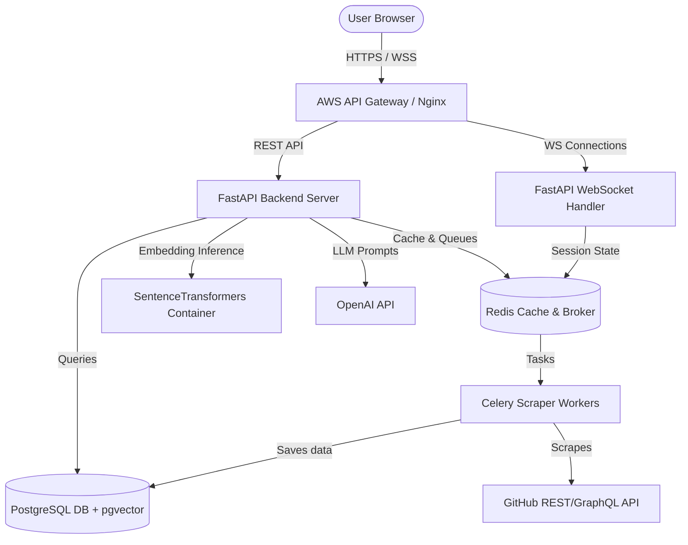
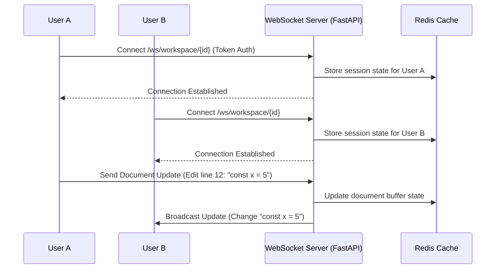
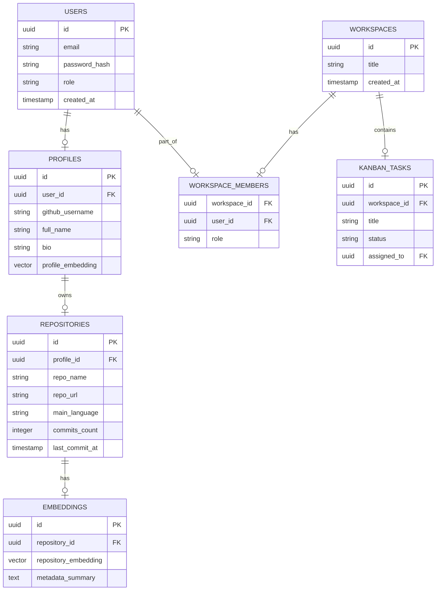
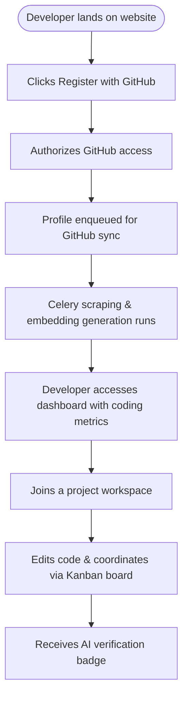

# DevSphere: AI-Powered Developer Collaboration & Hiring Platform
## System Design, Architecture, and Product Specification Document

---

## 1. Project Overview

### 1.1. Project Name & Tagline
* **Project Name:** DevSphere
* **Tagline:** "Synthesizing Github activity, semantic search, and collaborative workspaces to match developers with their dream teams."

### 1.2. Problem Statement
The modern technical recruitment and open-source project collaboration landscape is broken. It relies on static resumes, subjective portfolio sites, and keyword-based search queries that fail to capture a developer's actual coding capabilities, code quality, or collaboration style.

#### Current Problems:
1. **Keyword Over-Reliance:** Traditional applicant tracking systems (ATS) screen candidates based on exact keyword matches (e.g., "React", "Python"), missing candidates with highly transferable skills who didn't list the exact terms.
2. **Resume Inflation:** Standard resumes do not verify code quality, structure, testing habits, or open-source community contributions.
3. **Friction in Team Formation:** In hackathons, academic groups, or startup incubators, finding teammates with complementary tech stacks and aligned work styles is a manual, hit-or-miss process.
4. **Context Switching in Collaboration:** Teams coordinate across GitHub, Slack, Jira, and Zoom. There is no unified space linking developer profiles directly to collaborative scratchpads and real-time execution environments.

#### Why Existing Solutions are Insufficient:
* **LinkedIn:** A general-purpose professional network prone to recruiter spam, lacking technical verification tools or repository integration.
* **GitHub:** Great for code hosting but lacks profile-matching tools, job search capabilities, or high-level collaborative workspaces.
* **Devpost:** Focused purely on hackathon submissions, not on year-round collaboration, team matching, or enterprise B2B hiring.

### 1.3. Proposed Solution
DevSphere is an AI-driven platform that integrates with GitHub to analyze public repository activity, commit histories, code quality, and styling habits. It uses machine learning to construct a high-dimensional vector representation of a developer’s technical profile. 

Through **Semantic Search (`pgvector`)**, **LLM-driven Code Review Summaries**, and a **Real-Time Collaborative Workspace (WebSockets)**, DevSphere facilitates high-fidelity matching between developers and recruiters or project founders, creating a unified portal for developers to showcase work, collaborate, and get hired.

### 1.4. Expected Impact
* **Recruiters:** Reduce time-to-hire by 40% through direct semantic matching of candidate codebases with job descriptions.
* **Developers:** Eliminate the need to construct artificial portfolio sites; let public Git code serve as a dynamic portfolio.
* **Organizations:** Form balanced project teams based on complementary skill indexes and historical collaboration patterns.

### 1.5. Target Audience & Potential Users
* **University Students / Hackathon Participants:** Seeking peer collaboration and team matching.
* **Recruiters & Hiring Managers:** Looking to verify developer skills through direct codebase analysis.
* **Open-Source Maintainers:** Seeking contributors who have worked on similar project libraries.

### 1.6. Business Value & Startup Potential
* **B2B SaaS Model:** Charge enterprise recruitment teams for advanced search filters, automated code review evaluations, and direct talent messaging pipelines.
* **API Monetization:** License the DevSphere Code Ingestion & Skill Profiler API to third-party ATS vendors.

---

## 2. Objectives

### 2.1. Primary Objectives
1. **Repository Ingestion Engine:** Build an asynchronous worker pool to scrape, parse, and analyze GitHub repositories, generating structured JSON representations of technologies used, code quality metrics, and commit frequencies.
2. **Semantic Profiling & Search:** Generate embedding vectors from developer profiles using `all-MiniLM-L6-v2` and leverage PostgreSQL `pgvector` to run cosine similarity queries for job-to-developer matching.
3. **Collaborative Workspace:** Create a real-time multiplayer editing environment using WebSockets to facilitate virtual pair-programming, chat, and collaborative task boards.

### 2.2. Secondary Objectives
1. **AI Peer Review Agent:** Develop an LLM-driven bot that comments on developer portfolios, identifying strengths (e.g., "Strong separation of concerns in React code") and areas of growth.
2. **Automated Skill Verification:** Issue cryptographic, verified profile badges based on codebase analysis (e.g., "Validated FastAPI Expert").

### 2.3. Long-term Vision
To become the global decentralized developer registry, replacing traditional resumes with verified, AI-audited repository profiles.

### 2.4. Future Scope
* Integration with GitLab, Bitbucket, and private organization workspaces.
* Fully containerized, cloud-hosted dev sandbox in the workspace for live coding evaluations.

---

## 3. Functional Requirements

### 3.1. User Onboarding & Authentication
* **Auth-01: GitHub OAuth Registration:** Users register using their GitHub credentials, automatically granting read permissions to public repositories.
* **Auth-02: Email Authentication:** Fallback login via standard email/password with verification links.
* **Auth-03: RBAC Configuration:** Users must select their primary role (Developer, Recruiter, or Incubator Mentor/Admin) during onboarding.

### 3.2. Developer Profile & Portfolio
* **Port-01: Auto-Generated Portfolios:** Parse public repository structures to build a portfolio showing technology distribution (languages, frameworks), commit frequency, and documentation quality.
* **Port-02: Portfolio Customization:** Allow developers to pin specific repositories, write bios, and highlight active projects.
* **Port-03: AI Skills Analyzer:** Asynchronously run LLM models on selected repository files to output qualitative code reviews.

### 3.3. Semantic Matchmaking & Search
* **Match-01: Natural Language Job/Team Querying:** Recruiters type queries (e.g., "Developer who knows Postgres optimization and writes clean FastAPI code").
* **Match-02: Compatibility Scoring:** Compute a percentage compatibility score based on the cosine distance between the developer profile vector and the query vector.
* **Match-03: Dynamic Filters:** Filter by location, availability, minimum experience, and specific GitHub metrics (e.g., number of forks, pull requests merged).

### 3.4. Collaborative Workspace
* **Work-01: Live Multiplayer Document Editor:** Enable multiple developers in a team to edit READMEs, project requirements, and code snippets simultaneously.
* **Work-02: Real-time Audio/Video Chat:** Low-latency workspace calls via WebRTC.
* **Work-03: Interactive Kanban Boards:** Drag-and-drop task tracking synchronized across all active workspace users.

### 3.5. Admin Dashboard
* **Adm-01: User Management:** Approve/suspend developer accounts and verify recruiter credentials.
* **Adm-02: API Usage Monitor:** Track execution rates of the background GitHub scraper and AI inference pipelines.

---

## 4. User Roles & Permissions

We identify four distinct user roles within DevSphere:

| Role | Responsibilities | Permissions | Workflow |
| :--- | :--- | :--- | :--- |
| **Developer** | Maintains profile, syncs repos, collaborates in workspaces, applies to teams. | Read-Write own data; Read public profiles; Join workspaces. | Log in -> Sync GitHub -> View AI Analysis -> Search for teams -> Apply. |
| **Recruiter** | Post jobs, search candidates semantically, view code quality analysis, message candidates. | Read public profiles; Read AI code evaluations; Write job postings. | Log in -> Enter natural language query -> View ranked candidates -> Open chat. |
| **Workspace Admin / Team Lead** | Creates collaborative workspaces, manages team members, creates Kanban cards. | Read-Write workspace settings; Invite/Remove members. | Create workspace -> Add Kanban tasks -> Invite developers -> Collaborate. |
| **Platform Administrator** | Monitors system health, handles spam, manages platform settings, scales resources. | Global administrative read-write access. | Monitor background queues -> Resolve system flags -> Configure models. |

---

## 5. Complete Feature List (Detailed Modules)

```
DevSphere Core Platform
├── Auth Module
├── Ingestion Engine (Scraper Worker)
├── Semantic Search Engine
├── Multiplayer Workspace Module
└── Recruiter Portal Module
```

### 5.1. Code Ingestion & Scraper Engine
* **Purpose:** Connects to GitHub, downloads repository structures, parses package manifest files (e.g., `package.json`, `requirements.txt`), and extracts commit activity history.
* **Workflow:**
  1. User authorizes GitHub account.
  2. Frontend sends authorization token to Backend API.
  3. Backend pushes an ingestion task to a Redis Queue.
  4. Celery worker picks up the task, queries the GitHub REST/GraphQL API.
  5. Scraped data is structured into a JSON payload and written to PostgreSQL.
  6. Embedding generation is triggered.
* **Inputs:** GitHub OAuth Token, username, array of repository URLs.
* **Outputs:** Structured repository logs, technology usage weights, code complexity statistics.
* **Dependencies:** GitHub GraphQL API, Redis Broker, Celery Workers.
* **Possible APIs:** GitHub API v4.
* **AI Integration:** LLM summarizes overall code characteristics based on a sample of files.

### 5.2. Semantic Search & Profiling Module
* **Purpose:** Translates text data into embeddings and searches for similarities.
* **Workflow:**
  1. Profile/Job Description text is combined (e.g., `Bio + Skills + Projects`).
  2. FastAPI routes text to the embedding service.
  3. `SentenceTransformers` model generates a 384-dimension vector.
  4. Vector is stored in the database using the `pgvector` extension.
  5. Search query is vector-embedded and searched using `<=>` (cosine distance).
* **Inputs:** Raw developer metadata text.
* **Outputs:** 384-dimension vector float array.
* **Possible APIs:** HuggingFace Serverless inference API or local containerized models.

---

## 6. AI Features & Models

### 6.1. Semantic Developer-to-Job Matching Engine
* **Why AI is Needed:** Traditional keyword searches miss developer profiles that use alternative terms (e.g., "Golang" vs "Go", "NextJS" vs "React Router"). Semantic embeddings capture underlying conceptual similarities.
* **Inputs:** Developer Profile summary text (e.g., *"Senior frontend developer with 4 years of experience building responsive dashboards in NextJS. Extensive work with Redux and Tailwind CSS."*)
* **Outputs:** 384-dimensional vector, similarity score relative to recruiters' search prompts.
* **Model:** `all-MiniLM-L6-v2` (from SentenceTransformers). Chosen because of its compact size, fast CPU/GPU inference, and excellent performance in semantic similarity benchmarks.
* **Possible Datasets:** Kaggle Developer Portfolios, StackOverflow public profile dumps.
* **Inference Pipeline:** FastAPI API endpoint -> SentenceTransformers model -> PostgreSQL `pgvector` query.

### 6.2. LLM Code Review & Portfolios Summary Agent
* **Input:** Raw code files (up to 3 selected files, maximum 500 lines total).
* **Output:** A structured JSON review containing overall rating, core strengths, design pattern usage, and actionable improvements.
* **Model:** `gpt-4o-mini` or Llama-3-8B-Instruct.
* **Prompt Engineering Structure:**
  ```
  SYSTEM: You are an expert Principal Software Engineer. Analyze the user's code for:
  1. Performance and algorithmic efficiency.
  2. Readability, clean coding principles, and separation of concerns.
  3. Security vulnerabilities.
  Provide your assessment in JSON format with fields: "summary", "strengths" (array), "weaknesses" (array), "suggestions" (array), "score" (1-10).
  USER: <Code File Contents>
  ```

---

## 7. System Architecture

DevSphere utilizes a **Modular Monolith** architecture with a distinct separation of concerns, facilitating a future migration to microservices.

* **Client:** Web UI built with Next.js (React), communicating via REST API and WebSockets. Hosted on AWS Amplify or CloudFront.
* **Backend:** FastAPI (Python), providing fast asynchronous handling of HTTP routes and WebSockets.
* **Database:** PostgreSQL (with `pgvector` extension) for relational data and semantic search vector storage.
* **Cache:** Redis for WebSocket session routing, active connection states, and background task queuing.
* **Background Worker:** Celery with Redis broker for repository scraping and processing.
* **Object Storage:** AWS S3 for saving code review outputs, profile cards, and static user media.
* **Monitoring:** Prometheus and Grafana for server metrics; OpenTelemetry for API tracing.

---

## 8. Architecture Diagrams

### 8.1. System Architecture Diagram


### 8.2. Collaborative Workspace Sequence Diagram


### 8.3. Database Relationship ER Diagram


---

## 9. Database Design

### 9.1. SQL Schema DDL (PostgreSQL)
```sql
-- Enable extension for vector searches
CREATE EXTENSION IF NOT EXISTS vector;

-- Table: Users
CREATE TABLE users (
    id UUID PRIMARY KEY DEFAULT gen_random_uuid(),
    email VARCHAR(255) UNIQUE NOT NULL,
    password_hash VARCHAR(255) NOT NULL,
    role VARCHAR(50) NOT NULL CHECK (role IN ('Developer', 'Recruiter', 'Admin')),
    created_at TIMESTAMP WITH TIME ZONE DEFAULT CURRENT_TIMESTAMP NOT NULL
);

CREATE INDEX idx_users_email ON users(email);

-- Table: Profiles
CREATE TABLE profiles (
    id UUID PRIMARY KEY DEFAULT gen_random_uuid(),
    user_id UUID UNIQUE NOT NULL REFERENCES users(id) ON DELETE CASCADE,
    github_username VARCHAR(100) UNIQUE,
    full_name VARCHAR(150),
    bio TEXT,
    profile_embedding VECTOR(384),
    created_at TIMESTAMP WITH TIME ZONE DEFAULT CURRENT_TIMESTAMP NOT NULL
);

-- Cosine similarity index for semantic search
CREATE INDEX idx_profiles_embedding ON profiles USING hnsw (profile_embedding vector_cosine_ops);

-- Table: Repositories
CREATE TABLE repositories (
    id UUID PRIMARY KEY DEFAULT gen_random_uuid(),
    profile_id UUID NOT NULL REFERENCES profiles(id) ON DELETE CASCADE,
    repo_name VARCHAR(255) NOT NULL,
    repo_url TEXT NOT NULL,
    main_language VARCHAR(50),
    commits_count INT DEFAULT 0,
    last_commit_at TIMESTAMP WITH TIME ZONE,
    updated_at TIMESTAMP WITH TIME ZONE DEFAULT CURRENT_TIMESTAMP NOT NULL
);

CREATE INDEX idx_repositories_profile ON repositories(profile_id);
```

### 9.2. Normalization & Structure
The schema is normalized to Third Normal Form (3NF). Data redundancy is minimized: developer portfolio details reside in the `profiles` table, individual codebase information lives in `repositories`, and security credentials map directly to `users`.

---

## 10. API Design (REST & WebSocket)

### 10.1. REST Endpoints

| Method | Endpoint | Description | Auth | Request Body | Response Success | Error Codes |
| :--- | :--- | :--- | :--- | :--- | :--- | :--- |
| **POST** | `/api/v1/auth/register` | Register a new user profile. | None | `{ "email": "test@domain.com", "password": "...", "role": "Developer" }` | `201 Created` | `400 Bad Request`, `409 Conflict` |
| **POST** | `/api/v1/auth/login` | Login user, return JWT Token. | None | `{ "email": "test@domain.com", "password": "..." }` | `{ "access_token": "...", "token_type": "bearer" }` | `401 Unauthorized` |
| **POST** | `/api/v1/profiles/sync` | Enqueue GitHub repository sync. | Bearer JWT | `{ "github_username": "octocat" }` | `{ "task_id": "scrape-uuid", "status": "Queued" }` | `422 Unprocessable` |
| **GET** | `/api/v1/search/candidates` | Semantic Candidate Search. | Bearer JWT | Query Params: `q=FastAPI+developer&limit=10` | `200 OK` (list of matching profiles + scores) | `400 Invalid query` |

### 10.2. WebSocket Endpoints
* **Endpoint:** `/ws/workspace/{workspace_id}`
* **Protocol:** WebSocket (WSS in Production)
* **Message Types:**
  * **Join Room:** `{ "type": "JOIN", "user_id": "uuid", "username": "name" }`
  * **Cursor Move:** `{ "type": "CURSOR", "x": 12, "y": 45 }`
  * **Text Edit:** `{ "type": "EDIT", "delta": "..." }`

---

## 11. Frontend Architecture

### 11.1. Directory Structure
```
devsphere-frontend/
├── src/
│   ├── components/            # Reusable UI Elements (Buttons, Inputs, Modals)
│   │   ├── ui/
│   │   ├── ProfileCard.tsx
│   │   └── WorkspaceEditor.tsx
│   ├── layouts/               # Dashboard layouts, public layouts
│   │   ├── DashboardLayout.tsx
│   │   └── AuthLayout.tsx
│   ├── pages/                 # Next.js App Router views
│   │   ├── index.tsx          # Landing Page
│   │   ├── dashboard/
│   │   └── search/
│   ├── store/                 # Global state (Zustand)
│   │   ├── useAuthStore.ts
│   │   └── useWorkspaceStore.ts
│   ├── styles/                # CSS styles using standard CSS
│   │   └── globals.css
│   └── utils/                 # Help functions and API clients
│       └── api.ts
├── public/
├── package.json
└── tsconfig.json
```

### 11.2. State Management & Validation
* **State Management:** **Zustand** is selected for client-side state due to its simplicity, performance, and lack of boilerplate compared to Redux.
* **Form Validation:** **React Hook Form** coupled with **Zod** schema validations for type-safe form verification (e.g. strict email and password strength rules).

---

## 12. Backend Architecture

### 12.1. Directory Structure
```
devsphere-backend/
├── app/
│   ├── api/                   # API Routes (Controllers)
│   │   ├── v1/
│   │   │   ├── auth.py
│   │   │   └── search.py
│   ├── core/                  # Configuration, security, database settings
│   │   ├── config.py
│   │   ├── database.py
│   │   └── security.py
│   ├── models/                # SQLModel (Pydantic + SQLAlchemy) Models
│   │   ├── user.py
│   │   └── profile.py
│   ├── repositories/          # Direct DB CRUD operations
│   │   ├── user_repo.py
│   │   └── profile_repo.py
│   ├── services/              # Business logic (Ingestion, AI matching)
│   │   ├── github_service.py
│   │   └── ml_service.py
│   └── workers/               # Celery worker configuration
│       └── tasks.py
├── tests/
├── Dockerfile
├── requirements.txt
└── docker-compose.yml
```

### 12.2. Background Jobs Execution
FastAPI handles HTTP requests quickly by delegating long-running operations—like scraping Git logs and executing embedding calculations—to **Celery** workers.
* **Broker:** Redis.
* **Tasks:** `scrape_github_repos(user_id: UUID)`, `calculate_embeddings(profile_id: UUID)`.

---

## 13. Tech Stack & Architectural Decisions

| Layer | Technology | Rationale |
| :--- | :--- | :--- |
| **Frontend** | **Next.js (React)** | React's dynamic component framework paired with Next.js Server-Side Rendering (SSR) for fast loading times and optimized SEO structure. |
| **Backend** | **FastAPI (Python)** | High-performance asynchronous routing, automatic Swagger generation, and standard Python bindings for PyTorch/transformers. |
| **Database** | **PostgreSQL** | Enterprise database reliability combined with `pgvector` for unified tabular metadata and fast vector similarity scans. |
| **Caching/WS** | **Redis** | In-memory key-value engine matching high-speed updates for WebSocket connections and celery queue management. |
| **ORM** | **SQLModel** | Blends Pydantic validation schemas directly with SQLAlchemy databases, removing double-definition layers. |
| **Containerization**| **Docker** | Isolates FastAPI execution scripts, database setups, and worker jobs during development and deployment phases. |

---

## 14. DevOps, CI/CD, & Cloud Infrastructure

### 14.1. AWS Architecture
* **Networking:** AWS VPC with 2 public subnets (for ALB / NAT Gateway) and 2 private subnets (hosting ECS Tasks and RDS).
* **Compute:** **AWS ECS Fargate** runs backend API containers, automatically scaling out based on CPU usage.
* **Storage:** **Amazon RDS PostgreSQL** (Multi-AZ for high availability) and **Amazon S3** (media storage).

### 14.2. CI/CD Pipeline (GitHub Actions Configuration)
```yaml
name: DevSphere CI/CD

on:
  push:
    branches: [ main ]

jobs:
  test:
    runs-on: ubuntu-latest
    steps:
      - uses: actions/checkout@v3
      - name: Set up Python
        uses: actions/setup-python@v4
        with:
          python-version: '3.10'
      - name: Install dependencies
        run: |
          pip install -r requirements.txt
          pip install pytest
      - name: Run Tests
        run: pytest

  deploy:
    needs: test
    runs-on: ubuntu-latest
    steps:
      - name: Configure AWS credentials
        uses: aws-actions/configure-aws-credentials@v1
        with:
          aws-access-key-id: ${{ secrets.AWS_ACCESS_KEY_ID }}
          aws-secret-access-key: ${{ secrets.AWS_SECRET_ACCESS_KEY }}
          aws-region: us-east-1
      - name: Build and Push Docker image
        run: |
          docker build -t devsphere-api .
          docker tag devsphere-api:latest ${{ secrets.ECR_REGISTRY }}/devsphere:latest
          docker push ${{ secrets.ECR_REGISTRY }}/devsphere:latest
```

---

## 15. Security Hardening

* **Authentication:** **HS256 JWT** access tokens with an expiration limit of 15 minutes, accompanied by refresh tokens stored in secure, HttpOnly, SameSite=Strict cookies.
* **OAuth Security:** Implement strict State parameters during GitHub handshakes to prevent CSRF cross-origin redirects.
* **Data Encryption:** TLS 1.3 encryption in transit for HTTPS/WSS. AES-256 block-level encryption for database storage blocks (TDE).
* **Rate Limiting:** Nginx rate-limiting configured at 100 requests per minute per IP to prevent DDoS and API scraping exhaustion.

---

## 16. Scalability Strategy

* **Read Optimization:** Redis caches public developer profiles (`TTL: 1 hour`), reducing SQL scan operations on read-intensive queries.
* **Database Partitioning:** Partition vector databases along region or key language spaces to limit index search trees.
* **Horizontal Scaling:** Auto-scale API nodes dynamically based on ECS CPU metrics (`> 70%` load triggers a container replication event).

---

## 17. UI/UX Planning (Screen Specifications)

1. **Landing Page:** Interactive portfolio builder preview, scrolling dynamic developer cards, search bar demo, clear "Sign Up with GitHub" CTA.
2. **Developer Dashboard:** Git analysis statistics panel (commit graphs, programming language distribution donut chart), active workspaces list, notifications feeds.
3. **Recruiter Search Engine:** Large natural language query bar, filter panels (Languages, Experience, Cost), paginated candidate result lists containing profile details and vector match percentages.
4. **Multiplayer Collaboration Workspace:** Side-by-side splits: Markdown editor (left), real-time team Chat/Kanban task manager (right). Responsive layouts ensure usability on tablets.

---

## 18. User Journey Map



---

## 19. Third-Party Integrations

* **GitHub REST & GraphQL API:** Imports repositories, files, user commits, and user profile data.
* **OpenAI API:** Orchestrates LLM prompt pipelines for automated developer code review metrics.
* **Resend/SendGrid API:** Send transactional verification links and direct message notification alerts.
* **AWS S3:** Host generated profile summary PDFs and user-uploaded resumes.

---

## 20. Code Repository Folder Structure

```
Project-Ideation-and-System-Design/01-DevSphere/
├── README.md                      # Comprehensive system design specs (current file)
├── ui-ux/                         # Layouts, themes, design guides
├── api/                           # API specs (openapi.json)
├── database/                      # Table DDLs & migration scripts
├── architecture/                  # Microservices blueprints
└── diagrams/                      # Mermaid diagram representations
```

---

## 21. Development Roadmap

```
Milestones:
[Phase 1: Foundation] ===> [Phase 2: Ingestion & AI] ===> [Phase 3: Multiplayer] ===> [Phase 4: Optimization] ===> [Phase 5: Release]
```

* **Phase 1: System Foundation (Weeks 1-4):** Establish auth flows, base PostgreSQL tables, basic UI templates.
* **Phase 2: Ingestion Engine & Vector Matching (Weeks 5-8):** Connect GitHub scraper worker pipelines, configure `pgvector` indexing, and integrate embedding APIs.
* **Phase 3: Multiplayer Collaboration Workspace (Weeks 9-12):** Implement WebSocket backend server hubs, code editor sync engines, and dynamic Kanban tools.
* **Phase 4: Security & Scaling Audit (Weeks 13-14):** Conduct JWT lifecycle hardening, pen testing, Redis profiling, and API performance testing.
* **Phase 5: Deployment & Demo Preparation (Weeks 15-16):** Set up final AWS pipelines, seed sandbox mock data, and organize demonstration scripts.

---

## 22. Testing Strategy

* **Unit Testing:** Write PyTest checks mapping FastAPI endpoints, and Jest assertions testing React component interfaces.
* **Integration Testing:** Mock database pipelines to verify GitHub repository scraper actions and embedding creations.
* **E2E Testing:** Playwright script suites simulating a complete journey: user logs in -> requests profile update -> triggers AI workspace.
* **Performance Testing:** Launch k6 testing clusters executing up to 1,000 requests/sec simulating high concurrent workspace updates.

---

## 23. Technical & Business Challenges

### 23.1. Technical Challenges
* **API Rate Limits:** GitHub REST API limits anonymous requests. Resolved by routing tasks through authenticated OAuth tokens of developers.
* **Embedding Inference Latency:** Vector processing can take time. Solved by decoupling query embedding processing to background worker servers.

### 23.2. Business Challenges
* **Platform Cold-Start:** Convincing recruiters to pay before developer profiles exist. Resolved by pre-populating indices using public open-source developer databases.

---

## 24. Future Enhancements (30 Scalability & Feature Proposals)

1. **Auto Git PR Refactoring Suggestions:** AI logs PR reviews and auto-proposes diff files.
2. **Decentralized Reputation Badges:** Move verified skill credentials to an on-chain ledger.
3. **Collaborative Docker Terminals:** Run terminal scripts directly within workspaces.
4. **VCS Provider Extension:** Scrape GitLab, BitBucket, and public GitLab server ports.
5. **Dynamic Mock Interviews:** Voice-enabled AI interviewing developers on custom projects.
6. **Smart Contract Portfolios:** Audit Solidity files and deploy tracking records.
7. **Semantic Job Recommender:** Suggest jobs to developers based on profile similarity scores.
8. **Git Commit Heatmap Widgets:** Export profile badges to standard readme files.
9. **Automatic Portfolio Video Generation:** AI reviews repositories and produces video overviews.
10. **Multi-Tenant Org Workspaces:** Provide private instances of DevSphere to companies.
11. **Automatic Readme Generators:** AI updates project readmes based on commit logs.
12. **Automatic License Scanners:** Identify license violations in public portfolio projects.
13. **Plagiarism Scanners:** Detect duplicated or copy-pasted code structures.
14. **Custom Coding Challenges:** Integrated testing tools inside the workspaces.
15. **Collaborative Whiteboard:** Real-time design canvas integrated into teams.
16. **Voice-to-Code Integrations:** Voice command support in collaborative editors.
17. **Dependency Alert Notifications:** Real-time vulnerability flags in portfolio projects.
18. **CI/CD Integrations:** Run tests inside DevSphere workspaces.
19. **Automatic API Mocking:** Auto-generate mock API servers based on spec files.
20. **Visual UI Screen Generators:** Generate front-end design codes directly in workspaces.
21. **Performance Bottleneck Profilers:** Flag inefficient loops in repository code.
22. **Automated Documentation Writers:** Parse API codebases to write OpenAPI specifications.
23. **Code Style Linters:** Enforce common formatting metrics on overall profile charts.
24. **Multi-Language Video Subtitles:** Translate video reviews to local languages.
25. **Interactive DB Design Canvas:** Draw DB schemas in workspace to export SQL code.
26. **Automatic Migration Generators:** AI writes SQL migrations based on model modifications.
27. **Predictive Project Timelines:** Estimate project completion dates using developer velocity.
28. **Freelance Smart Escrow Contracts:** Automate payments using smart escrow integrations.
29. **GitHub Actions Marketplace Tools:** Provide a custom plugin inside GitHub CI.
30. **Developer Mental Health Trackers:** Identify developer fatigue by code commit metrics.

---

## 25. Research Opportunities & Publications

### 25.1. Research Topics
* **Concept:** *Semantic Analysis of Multi-Language Software Repositories using High-Dimensional Vectors.*
* **Novelty:** Combining abstract syntax tree structure representations with natural language representations to construct unified developer profile vectors.
* **Publication Venues:** IEEE Transactions on Software Engineering, International Conference on Software Engineering (ICSE).

---

## 26. Resume Value & Skills Demonstrated
* **AI/ML Engineering:** Custom text embed pipelines, pgvector storage indexing.
* **System Design:** Asynchronous queue design, real-time sync systems using WebSockets.
* **DevOps Infrastructure:** Full Docker Compose build pipelines, AWS infrastructure orchestration, and automated CI/CD configurations.

---

## 27. Demonstration Scenario

1. **System Introduction (2 mins):** Explain core objectives and walkthrough architectural designs.
2. **Onboarding Showcase (3 mins):** Register developer profile, connect GitHub handle. Show scraper processing repository metrics.
3. **AI Search Demonstration (3 mins):** Log in as recruiter, search: "FastAPI developer with Redis caching skills." Show semantic matching returns the newly synced profile.
4. **Collaborative Pair Programming (2 mins):** Open workspace and show dual user movements and edit synchings in real time.

---

## 28. Screens to Build (10 Screen Blueprints)

1. **Landing View:** Pitch summary and GitHub signup actions.
2. **Auth Gateway:** Login options (GitHub OAuth, password fields).
3. **Candidate Search Dashboard:** Semantic search search bar and filters.
4. **Developer Summary Dashboard:** Portfolio profile cards, commit history metrics, and tech stack distribution chart.
5. **Workspace Hub:** List of current collaborative environments.
6. **Live Editor Sandbox:** Coding space, side chats, active member cursors.
7. **Task Workspace (Kanban):** Drag-and-drop boards.
8. **Admin Panel:** Global configuration tracking controls.
9. **Settings Dashboard:** Profile updates, password settings, OAuth configs.
10. **Global Notification Panel:** Real-time request prompts.

---

## 29. Success Metrics & Key Performance Indicators (KPIs)

* **Performance:** Real-time synchronization latency of text updates below 50ms.
* **Search Efficiency:** Semantic profile match indexing processing under 150ms.
* **User Engagement:** Daily Active Users (DAU) retention, average workspace session duration.
* **Business KPI:** Conversion rate of recruiters upgrade to paid search tiers.

---

## 30. Conclusion

DevSphere represents a modern system design that combines modern AI architectures (RAG, embeddings) with practical, high-throughput collaborative features. Developing it as a modular monolith ensures low deployment overhead for a startup phase, while maintaining clean service boundaries that facilitate scaling. This project showcases enterprise-grade practices in API design, databases, security, and cloud operations.
