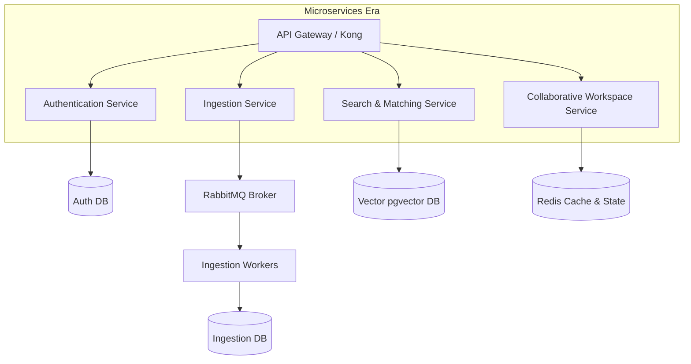

# DevSphere: Architectural Blueprints & Migration Plan

This directory documents the evolutionary path of DevSphere from a **Modular Monolith** to a **Distributed Microservices Architecture** to support global scale.

## 1. Monolith-to-Microservices Roadmap

Initially, DevSphere is built as a modular monolith where codebase domains are isolated into python modules within a single codebase:
- `app.api.v1.auth` (Authentication)
- `app.services.github_service` (Ingestion)
- `app.services.ml_service` (AI & Search)
- `app.api.v1.workspace` (Multiplayer Workspace)

As request counts grow, these modules will decouple into independent deployments.

## 2. Microservice Domains

1. **Authentication Service:**
   - Tech: Node.js or Go for quick JWT validations.
   - Database: Isolated User database (PostgreSQL).
2. **Ingestion Service:**
   - Tech: Python FastAPI + Celery worker pools.
   - Database: Scraped codebase metadata store.
3. **Search & Matching Service:**
   - Tech: Python FastAPI + PyTorch GPU containers.
   - Database: Vector Database (`pgvector` or Pinecone).
4. **Collaborative Workspace Service:**
   - Tech: Go (Golang) for fast WebSockets management.
   - Database: In-memory Redis store for active state.
