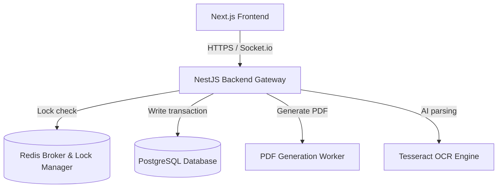
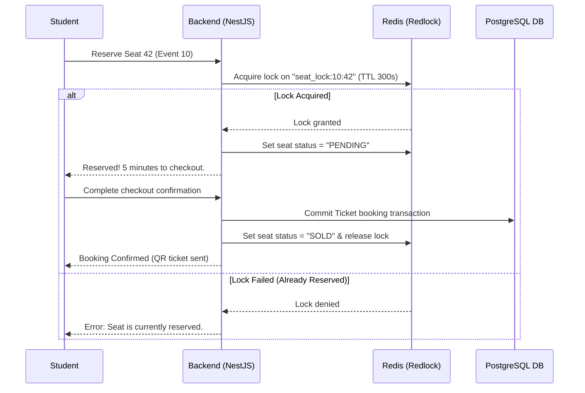
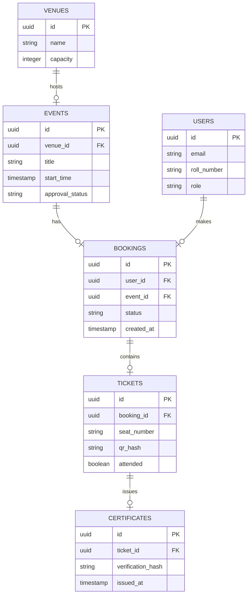

# Campus Events Platform: Coordination, Booking, and Certification Engine
## System Design, Architecture, and Product Specification Document

---

## 1. Project Overview

### 1.1. Project Name & Tagline
* **Project Name:** Campus Events Platform (CEP)
* **Tagline:** "Unifying campus activities, optimizing high-demand tickets, and automating certification distribution."

### 1.2. Problem Statement
Managing events within large university environments is currently highly fragmented and plagued by execution bottlenecks. Individual student clubs coordinate via separate social media channels, booking tickets is plagued by crash-prone servers during high-demand cultural festivals, and issuing event participation certificates remains a manual, error-prone clerical task.

#### Current Problems:
1. **Inefficient Venue Scheduling:** No centralized calendar mapping exists, leading to conflicting reservations for seminar halls or auditoriums.
2. **Crash-Prone Booking Systems:** Popular events experience massive, spiky traffic surges that overwhelm database connection pools.
3. **No Dynamic Seat Maps:** Ticket booking systems lack real-time visual feedback on seat layouts, causing double-bookings.
4. **Delayed Certificate Distribution:** Event attendance is tracked using paper sheets, delaying the generation and distribution of participation certificates.

#### Why Existing Solutions are Insufficient:
* **Eventbrite:** Lacks support for specific campus constructs (e.g. roll numbers, student email validations, and integration with academic systems).
* **Google Forms:** No support for seat allocation, queue management, or automatic QR validation at entry doors.

### 1.3. Proposed Solution
The Campus Events Platform is an enterprise-grade booking and event administration system. It integrates a **NestJS backend** with **Next.js** to handle high-concurrency event booking using **Redis queues** and distributed locks. 

It provides real-time venue seating updates via **WebSockets (Socket.io)** and leverages **Tesseract OCR / LLM analysis** to verify user-submitted flyers for community points. Finally, it uses automated certificate templates to generate and email verified PDF certificates with unique validation hashes.

### 1.4. Expected Impact
* **Clubs & Organizers:** Streamline event approvals, venue scheduling, and attendance verification.
* **Students:** Secure tickets instantly through a fair queuing system and receive certificates within minutes of event completion.
* **Administrators:** Gain a single dashboard to audit event compliance, attendance statistics, and venue utilization.

### 1.5. Target Audience & Potential Users
* **Students:** Event attendees, ticket buyers, and certificate recipients.
* **Club Presidents:** Event creators and organizers.
* **Faculty/Dean of Student Affairs:** Approval authority and policy administrators.

### 1.6. Business Value & Startup Potential
* **SaaS White-Labeling:** License the software to universities as a cloud-hosted campus management utility.
* **Sponsorships:** Offer premium sponsorship banners on ticket PDFs and event listing views.

---

## 2. Objectives

### 2.1. Primary Objectives
1. **High-Concurrency Booking System:** Build a ticket queuing system capable of handling 500 requests per second during peak ticket release windows.
2. **Real-time Seating Allocation:** Implement dynamic seat selections synchronized across clients via WebSockets.
3. **Verified Certificate Automation:** Automatically generate secure PDF attendance records containing QR verification hashes.

### 2.2. Secondary Objectives
1. **Automated Event Approval Workflows:** Implement multi-level approval states (Club Head -> Faculty -> Dean) with real-time email notifications.
2. **Clubs Analytics Panel:** Track registration statistics, attendee conversion rates, and feedback metrics.

---

## 3. Functional Requirements

### 3.1. User Management & Authentication
* **Auth-01: Campus SSO Integration:** Log in using University email domains with active student roll number metadata fields.
* **Auth-02: Role-Based Authorization:** Assign specific permissions based on roles: Student, Club Head, Faculty Coordinator, and Super Admin.

### 3.2. Event Management
* **Event-01: Event Creation Wizard:** Multi-step form capturing title, venue, dates, capacity, seat types, and approval files.
* **Event-02: Venue Conflict Checker:** Check existing bookings in the database to prevent double-booking a venue during creation.

### 3.3. Concurrency Booking & Ticketing
* **Book-01: Virtual Queueing:** Place incoming users into a Redis sorted set queue if requests exceed server capacity.
* **Book-02: Transaction Locks:** Secure seat allocations using Redis distributed locking (Redlock) during the 5-minute checkout window.
* **Book-03: QR-Code Generation:** Generate ticket confirmations with embedded cryptographic verification codes.

### 3.4. Attendance & Certification
* **Cert-01: QR Scanning System:** Web-based portal enabling door volunteers to scan tickets and log attendance in the database.
* **Cert-02: PDF Auto-generation:** Auto-populate canvas templates with student data and distribute via automated mail queues.

---

## 4. User Roles & Permissions

CEP defines the following system roles:

| Role | Responsibilities | Permissions | Workflow |
| :--- | :--- | :--- | :--- |
| **Student** | Browses events, books tickets, checks certificates, gives event feedback. | Read-Write own bookings; Read public events. | Browse catalog -> Join ticket queue -> Complete booking -> Attend event -> Download PDF. |
| **Club Head** | Submits event plans, manages seating maps, checks ticket sales, generates certificates. | Read-Write own club events; Manage attendees. | Submit event proposal -> Await approval -> Publish event -> Scan entries -> Issue certificates. |
| **Faculty Coordinator** | Audits club submissions, approves venue allocations, monitors event compliance. | Read all club requests; Approve/Deny events. | Receive email alert -> View event details -> Approve venue booking -> View final stats. |
| **Super Admin** | Configures system venues, manages campus profiles, views global analytics, resolves tickets. | Absolute system read-write access. | Configure new halls -> Assign roles -> Monitor system logs. |

---

## 5. Complete Feature List (Detailed Modules)

```
Campus Events Platform
├── Auth & Profile Module
├── Scheduling & Venue Manager
├── Concurrency Booking Engine
└── QR Door Verification & Certifier
```

### 5.1. Concurrency Booking Engine
* **Purpose:** Handles the booking flow when ticket demand surges.
* **Workflow:**
  1. Student selects a seat and clicks "Book Now."
  2. The server attempts to acquire a Redis Redlock for `seat_id:event_id`.
  3. If acquired, the seat status in Redis changes to `RESERVED` (TTL: 5 mins).
  4. Student is redirected to the checkout/confirmation form.
  5. On successful checkout, the database transaction updates the ticket status to `CONFIRMED`.
  6. If checkout fails or the TTL expires, the lock is released and the seat is marked as `AVAILABLE`.
* **Inputs:** `student_id`, `event_id`, `seat_number`.
* **Outputs:** Signed booking confirmation, transaction state.
* **Dependencies:** Redis Cache, PostgreSQL Transaction Layer.
* **AI Integration:** Predict peak ticket load times using historical event registration trends.

---

## 6. AI Features & Models

### 6.1. Smart Event Recommendation Engine
* **Why AI is Needed:** Students struggle to find relevant technical seminars or cultural events across dozens of active clubs. Personalized recommendations increase engagement.
* **Inputs:** Student's previous attendance history, department, list of registered clubs, and event descriptions.
* **Outputs:** A ranked list of recommended upcoming events.
* **Model:** Collaborative Filtering model + SentenceTransformers semantic similarity on event descriptions.
* **Possible Datasets:** Simulated student registration matrices.

### 6.2. Flyer OCR & Automation Validator
* **Why AI is Needed:** Student club leads submit community points logs containing flyers. Manual review of these files is labor-intensive.
* **Input:** PNG/JPG event flyers.
* **Output:** Extracted title, date, time, and validation matching score.
* **Model:** `Tesseract OCR` for text extraction + LLM parsing to compare extracted text with the database entry.

---

## 7. System Architecture

CEP is built using a **NestJS modular structure** connected to PostgreSQL and Redis.



---

## 8. Architecture Diagrams

### 8.1. High-Concurrency Seating Reservation Sequence Diagram


### 8.2. Database Entity Relationship Diagram (ERD)


---

## 9. Database Design

### 9.1. SQL Schema DDL
```sql
-- Table: Venues
CREATE TABLE venues (
    id UUID PRIMARY KEY DEFAULT gen_random_uuid(),
    name VARCHAR(150) NOT NULL,
    capacity INT NOT NULL,
    metadata JSONB
);

-- Table: Events
CREATE TABLE events (
    id UUID PRIMARY KEY DEFAULT gen_random_uuid(),
    venue_id UUID REFERENCES venues(id) ON DELETE SET NULL,
    title VARCHAR(255) NOT NULL,
    description TEXT,
    start_time TIMESTAMP WITH TIME ZONE NOT NULL,
    end_time TIMESTAMP WITH TIME ZONE NOT NULL,
    approval_status VARCHAR(50) DEFAULT 'Pending' CHECK (approval_status IN ('Pending', 'Approved', 'Rejected')),
    created_at TIMESTAMP WITH TIME ZONE DEFAULT CURRENT_TIMESTAMP NOT NULL
);

-- Index to query venue availability
CREATE UNIQUE INDEX idx_venue_booking_time ON events(venue_id, start_time, end_time) WHERE (approval_status = 'Approved');

-- Table: Bookings
CREATE TABLE bookings (
    id UUID PRIMARY KEY DEFAULT gen_random_uuid(),
    user_id UUID NOT NULL,
    event_id UUID NOT NULL REFERENCES events(id) ON DELETE CASCADE,
    status VARCHAR(50) DEFAULT 'Pending' CHECK (status IN ('Pending', 'Confirmed', 'Cancelled')),
    created_at TIMESTAMP WITH TIME ZONE DEFAULT CURRENT_TIMESTAMP NOT NULL
);
```

---

## 10. API Design

### 10.1. REST API Catalog

| Method | Endpoint | Description | Auth | Request Body | Response Success | Error Codes |
| :--- | :--- | :--- | :--- | :--- | :--- | :--- |
| **POST** | `/events` | Create a new event. | JWT (Club Head) | `{ "title": "AI Summit", "venue_id": "...", "start_time": "..." }` | `201 Created` | `400 Bad Request`, `409 Conflicting Venue` |
| **POST** | `/bookings` | Enqueue a ticket booking request. | JWT (Student) | `{ "event_id": "...", "seat_number": "A12" }` | `202 Accepted` | `401 Unauthorized`, `429 Queue Full` |
| **PATCH** | `/tickets/:id/verify` | Scan QR ticket and verify entry. | JWT (Volunteer) | `{ "qr_hash": "aef9120b..." }` | `{ "status": "VERIFIED", "student": "John Doe" }` | `404 Ticket Invalid` |

---

## 11. Frontend Architecture (Next.js & Zustand)
* **Pages:**
  - `/`: Event Discovery Dashboard
  - `/events/create`: Multi-step creator flow
  - `/events/[id]/book`: Live visual interactive seating map
  - `/profiles/certificates`: Wallet display for earned PDF credentials
* **Validation:** Forms validate schemas using Zod.

---

## 12. Backend Architecture (NestJS Modular Structure)
* **Modules:**
  - `AuthModule`: Manages SSO handshakes and RBAC guards.
  - `BookingModule`: Orchestrates Redis locks and transactional SQL writes.
  - `MailModule`: Asynchronously handles ticket and certificate delivery.

---

## 13. Tech Stack Justification

* **Frontend:** Next.js (TailwindCSS) – fast server-side loading speed.
* **Backend:** NestJS (Node.js) – robust out-of-the-box TypeScript structure with built-in WebSocket support.
* **ORM:** Prisma – type-safe database queries.
* **State Store:** Redis – provides dynamic locking, rate-limiting, and ticket queuing.

---

## 14. DevOps & Cloud Deployments

* **Deployments:** Docker containers orchestrate NestJS engines.
* **AWS Setup:** Deploy application containers to **AWS ECS Fargate**, using an Application Load Balancer to route client traffic. Use **ElastiCache Redis** to manage transaction locks and session routing.

---

## 15. Security Hardening
* **Concurrency Protection:** Optimistic locking inside database tables (`version` integer incremental checks) combined with Redis locks to prevent double-booking.
* **Input Sanitization:** NestJS validation pipes filter cross-site scripting (XSS) inputs.

---

## 16. Scalability Strategy
* **Queue Orchestration:** When ticket demand spikes, incoming requests bypass PostgreSQL and are enqueued directly into Redis. Worker pods read from the queue to process bookings asynchronously.

---

## 17. UI/UX Page Blueprints
1. **Interactive Seat Planner:** Grid visualization of seats color-coded by availability: Green (Available), Yellow (Reserved/Pending), Red (Sold).
2. **Student Certificate Wallet:** Clean, dashboard showing cards for earned certificates. Includes a "Download PDF" button and a "Verify Hash" link.

---

## 18. User Journey Map
1. **Browse:** Student opens Discovery dashboard -> filters by "Workshops".
2. **Queue:** Selects a workshop and joins the booking queue.
3. **Lock:** Redis reserves seat "E-10" for 5 minutes.
4. **Checkout:** Student completes checkout; database confirms the ticket.
5. **Entry:** Volunteer scans QR code at the door using a mobile camera.
6. **Certificate:** Attendance is logged, and the system sends a verified PDF certificate via email.

---

## 19. Third-Party Integrations
* **Tesseract.js / OCR:** Extracts flyer text during the event registration flow.
* **Nodemailer / Resend:** Delivers tickets and PDF certificates.
* **AWS S3:** Stores PDFs and raw event assets.

---

## 20. Code Repository Folder Structure
```
Project-Ideation-and-System-Design/02-Campus-Events-Platform/
├── README.md                      # Comprehensive system design specs (current file)
├── ui-ux/                         # Layouts, themes, design guides
├── api/                           # API specs
├── database/                      # Table DDLs
├── architecture/                  # Microservices blueprints
└── diagrams/                      # Mermaid diagram representations
```

---

## 21. Development Roadmap
* **Phase 1 (Weeks 1-4):** Database architecture, NestJS boilerplate, and auth implementation.
* **Phase 2 (Weeks 5-8):** Redis booking queues, locking mechanisms, and seat map interfaces.
* **Phase 3 (Weeks 9-12):** WebSocket event streaming, QR scanning, and PDF builders.
* **Phase 4 (Weeks 13-14):** Load testing (k6 simulation of ticketing spikes) and security audit.
* **Phase 5 (Weeks 15-16):** Cloud staging deployment and presentation setup.

---

## 22. Testing Strategy
* **Unit Testing:** Jest suites mock NestJS modules.
* **Load Testing:** run k6 tests simulating ticket rushes (`1,000 requests/sec` over 30 seconds) to verify Redis queue stability.

---

## 23. Technical & Business Challenges
* **Race Conditions:** Resolving conflicting reservations when multiple requests attempt to book the same seat at the exact same millisecond. Resolved using Redis locks and database database constraints.

---

## 24. Future Enhancements (30 Scalability & Feature Proposals)
1. **Google Wallet Certificate Sync:** Export certificates to Google/Apple wallets.
2. **Live Crowd Map:** Interactive crowd density mapping.
3. **Automated Budget Tracking:** Manage club budgets.
4. **QR-Based Food Coupon System:** Integrated event catering tools.
5. **Dynamic Pricing Engine:** Implement early-bird pricing algorithms.
6. **Inter-College Ticket Booking:** Shared platform access for external colleges.
7. **SMS Alert Integration:** Twilio notifications for event updates.
8. **Student Talent Portals:** Connect event performers with club managers.
9. **Automatic Event Feedback Surveys:** Email surveys post-attendance.
10. **Custom Badge Creators:** Drag-and-drop tool for certificate templates.
11. **Academic Credit Verification:** Direct integration with registrar systems.
12. **AI Schedule Optimizer:** Suggest event dates based on exam timetables.
13. **Audio-Guided Venue Tours:** Help visitors navigate to event locations.
14. **In-App Social Feed:** Allow attendees to post photos from events.
15. **Offline Scanning Mode:** Store QR scans locally on mobile and sync when online.
16. **Shared Event Calendars:** Export campus events to Google Calendar.
17. **Multi-Stage Booking Flows:** Split tickets into general admission and VIP pools.
18. **Automated Equipment Requesting:** Request microphones/projectors automatically.
19. **Lost & Found Channel:** Event-specific community forums for lost items.
20. **AI Event Summarizer:** Auto-generate post-event reports.
21. **Voucher Promo Codes:** Manage club discount codes.
22. **Sponsor Banner Portals:** Manage sponsor assets and placements.
23. **Parent/Guest Entry Permits:** Issue guest passes.
24. **Multi-Camera QR Scans:** Support scanning across multiple entrances.
25. **Alumni Event Invitations:** Connect alumni with student activities.
26. **Interactive Q&A Sessions:** Real-time polling inside the app.
27. **Automatic Slides Compiler:** Combine slide submissions into a single presentation.
28. **Climate Footprint Estimator:** Track resource usage for green certification.
29. **Subscription Calendars:** Get notified when specific clubs post events.
30. **Faculty Activity Logs:** Audit logs for approval decisions.

---

## 25. Research Opportunities
* **Topic:** *Optimizing High-Concurrency Seat Allocation Algorithms in Resource-Constrained Environments.*
* **Publication Venues:** Journal of Systems and Software, ACM Transactions on Computer-Systems.

---

## 26. Resume Value & Skills Demonstrated
* Real-time networking (WebSockets/Socket.io).
* Distributed locking and queue management (Redis Redlock).
* High-concurrency database transaction optimization.

---

## 27. Demonstration Scenario
1. **Setup:** Open the admin panel and create an event with a 100-seat capacity.
2. **Stress Test:** Simulate 50 concurrent ticket purchases using automated scripts. Show that the backend processes them without errors and prevents double bookings.
3. **QR Entry:** Scan a booking QR code using a mobile browser, verifying that attendance is logged immediately.
4. **Certificate Delivery:** Show that a verified PDF certificate is instantly generated and delivered to the user's email inbox.

---

## 28. Screens to Build
1. **Event Discovery Grid:** List view of active and upcoming events.
2. **Interactive Seat Booker:** Visual grid showing seat selection layouts.
3. **Club Manager Board:** Panel to check registrations and approve entries.
4. **Attendance QR Scanner:** Mobile-responsive interface for gate staff.
5. **Certificate PDF Wallet:** Download dashboard for earned credentials.

---

## 29. Success Metrics
* **Booking Latency:** Average ticketing confirmation completed under 150ms.
* **Server Performance:** No database connection pool depletion under simulated load.
* **QR Validation Time:** Scan verification resolved in under 200ms at the door.

---

## 30. Conclusion
The Campus Events Platform addresses a highly practical problem using standard web technologies. By implementing transaction safety with Redis locks, this project provides students with a production-grade system design that is highly relevant to modern B2B/B2C application engineering.
