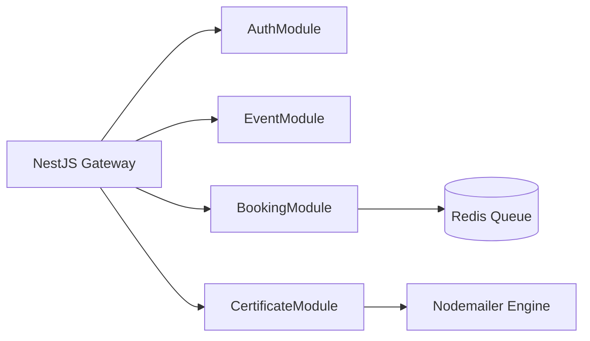

# Campus Events Platform: Architectural Migration Guide

CEP is developed as a modular monolith in NestJS. As the platform expands to support multiple campuses, the system will migrate to a serverless and containerized microservices architecture.

## 1. Modular Architecture Overview

Our monolith organizes code boundaries using NestJS modules:
- `AuthModule`: Handles SSO, logins, and JWT generation.
- `EventModule`: Manages scheduling, venue availability, and approvals.
- `BookingModule`: Handles seat booking transactions and Redis queues.
- `CertificateModule`: Manages PDF generation and distribution.

## 2. Serverless Microservices Vision

1. **Ticket Booking Service:**
   - Tech: Node.js Lambda function connected to **Amazon DynamoDB** for high transactional scalability.
2. **Scraper & PDF Workers:**
   - Tech: AWS Lambda triggered by SQS queue events.
3. **Notification Engine:**
   - Tech: Amazon SNS/SES for email delivery.
