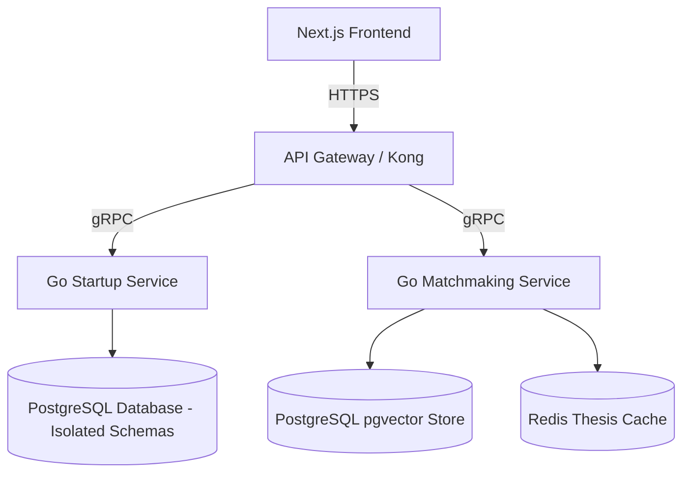
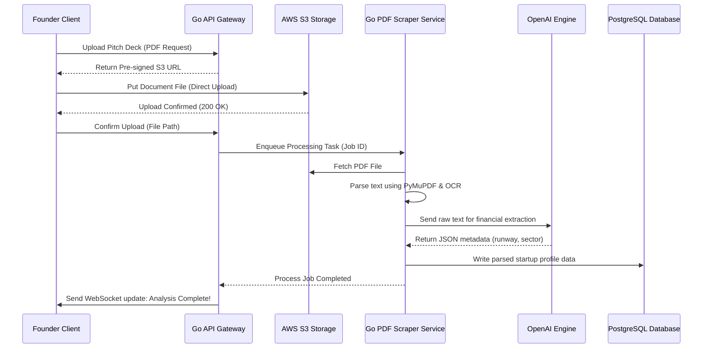
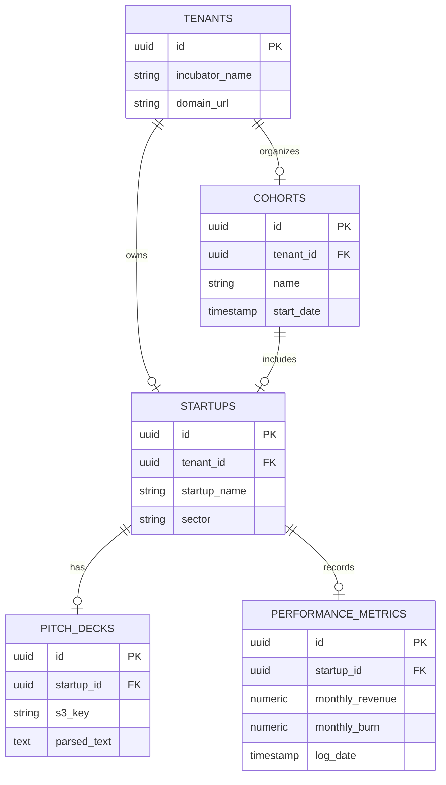

# Startup Incubator Platform: Equity-Free Accelerator Administration & Matchmaking Engine
## System Design, Architecture, and Product Specification Document

---

## 1. Project Overview

### 1.1. Project Name & Tagline
* **Project Name:** Startup Incubator Platform (SIP)
* **Tagline:** "Orchestrating accelerator pipelines, automating investor matchings, and securing startup audits."

### 1.2. Problem Statement
Incubators and early-stage startup accelerators operate on fragmented administrative systems. Program managers track applications via spreadsheets, founders struggle to connect with relevant mentors, and angel/VC investors receive pitch decks that mismatch their investment thesis. Additionally, tracking startup growth and key performance indicators (KPIs) over a multi-month cohort program is highly unorganized.

#### Current Problems:
1. **Inefficient Sourcing & Matching:** Pitch decks are manually reviewed. Investors waste time reviewing startups outside their ticket sizes or sector preferences.
2. **Disorganized Milestone Tracking:** No centralized panel records startup weekly updates, financial burns, and product progress.
3. **Data Leaks & Privacy Vulnerabilities:** Startups share sensitive financial predictions. General networks risk exposing pre-revenue intellectual property.
4. **Mentor Matching Friction:** Coordinating mentor office hours is managed through endless back-and-forth emails.

#### Why Existing Solutions are Insufficient:
* **AngelList:** A public recruiting/funding board; it does not offer private, cohort-focused accelerator workflows or milestone-tracking services.
* **HubSpot / general CRM:** Not optimized for multi-party relationships (Founder, Mentor, VC, Program Admin) or pitch deck parsing.

### 1.3. Proposed Solution
The Startup Incubator Platform is a B2B SaaS portal designed to manage incubator cohorts. Built with a high-performance **Golang (Fiber) backend** and **Next.js**, it uses **gRPC** for low-latency internal microservice communication. 

The system automates pitch deck screening using **PyMuPDF OCR + LLM analysis** to generate financial summaries. Startups are matched to investors based on a multidimensional cosine similarity matrix (`pgvector`). Startups are hosted in secure, isolated schemas to enforce strict multi-tenant data privacy.

### 1.4. Expected Impact
* **Founders:** Receive instant matchmaking scores with active VC partners and schedule mentor sessions.
* **Incubator Admins:** Automate application reviews and monitor cohort health through weekly KPI logs.
* **Investors:** Receive curated, AI-screened startup pitches matching their exact funding thesis.

### 1.5. Target Audience & Potential Users
* **Startup Founders:** Incubator applicants and cohort participants.
* **Mentors / Industry Experts:** Advisors providing guidance.
* **Investors (VCs, Angels):** High-net-worth individuals seeking investment deals.
* **Program Directors:** Incubator managers.

### 1.6. Business Value & Startup Potential
* **SaaS Enterprise Licenses:** Sell private-label instances to university and government accelerators.
* **Deal-Flow Commissions:** Take a small platform success fee on transactions closed through the system.

---

## 2. Objectives

### 2.1. Primary Objectives
1. **Multi-Tenant Schema Isolation:** Design a database architecture ensuring absolute data privacy between competing startups.
2. **Automated Pitch Screening:** Implement a document parsing pipeline that extracts funding requirements, team backgrounds, and sectors from PDFs.
3. **Smart Investment Matchmaker:** Build a recommendation engine to rank investors based on startup stage, funding needs, and industry.

### 2.2. Secondary Objectives
1. **Real-time Chat & Notifications:** Enable secure communications between founders and prospective investors.
2. **Weekly Performance Logs:** Dynamic dashboard tracking startup metrics (Burn Rate, Monthly Recurring Revenue, Active Users).

---

## 3. Functional Requirements

### 3.1. Authentication & Security
* **Auth-01: Multi-Factor Authentication:** Required for all user accounts, especially investors managing financial transactions.
* **Auth-02: Role-Based Access Control:** Strict permission blocks: Founder, Mentor, Investor, and Program Manager.
* **Auth-03: Signed NDA Flows:** Automatic Generation and electronic signing of NDAs prior to pitch access.

### 3.2. Startup Application Pipeline
* **App-01: Pitch Deck Upload:** Asynchronous PDF upload trigger with OCR extraction.
* **App-02: Weekly KPI Registry:** Founders upload key metrics (Revenue, Runway, Burn Rate) weekly.

### 3.3. Matchmaking & Venture Scouting
* **Venc-01: Thesis Configurator:** Investors enter funding stage preferences, minimum check sizes, and sectors of interest.
* **Venc-02: Scoring Index:** Startups are ranked based on a similarity score matching their profiles to investor profiles.

### 3.4. Mentor Office Hours
* **Ment-01: Calendar Sync:** Mentors share availability calendars. Founders can book slots.

---

## 4. User Roles & Permissions

SIP identifies five system roles:

| Role | Responsibilities | Permissions | Workflow |
| :--- | :--- | :--- | :--- |
| **Founder** | Manages startup profile, updates weekly KPIs, submits pitch decks, schedules mentorships. | Write own startup data; Request mentor calls. | Apply -> Set up profile -> Log KPIs -> Connect with Mentors -> Match with VCs. |
| **Investor** | Configures investment thesis, reviews matching startups, chats with founders. | Read approved startup profiles; Write thesis. | Configure preferences -> View recommended matches -> Review deck -> Request call. |
| **Mentor** | Posts office hours availability, reviews cohort pitches, logs session feedback. | Read assigned startup profiles; Write session logs. | Open calendar -> Log availability -> Accept founder invitations -> Log session notes. |
| **Program Manager** | Approves applications, assigns cohorts, tracks milestone compliance, reviews global statistics. | Read-Write cohort settings; Invite users. | Review applications -> Build cohorts -> Track metrics -> Audit investor connections. |
| **Super Admin** | Manages server configuration, handles billing, updates integrations, monitors system security. | Global administrative read-write access. | Monitor database performance -> Manage subscription billings -> Configure security patches. |

---

## 5. Complete Feature List (Detailed Modules)

```
Startup Incubator Platform
├── Auth & Security Guard
├── Pitch Deck Analysis Pipeline
├── Venture Matchmaking Index
└── Cohort KPI Tracker
```

### 5.1. Pitch Deck Analysis Pipeline
* **Purpose:** Automates reading and summarizing uploaded investor slide decks.
* **Workflow:**
  1. Founder uploads a PDF pitch deck.
  2. Next.js signs a secure S3 upload link.
  3. PDF is uploaded directly to AWS S3.
  4. S3 triggers an event pushing the document URL to a Go background service.
  5. Go service extracts text using PyMuPDF and OCR libraries.
  6. Text is formatted and processed using an LLM API to extract key financials.
  7. Output JSON is verified and written to the DB.
* **Inputs:** PDF document files.
* **Outputs:** Structured JSON (Sectors, Funding Needed, Team details).
* **Dependencies:** AWS S3, Go PDF Scrapers, OpenAI/HuggingFace APIs.

---

## 6. AI Features & Models

### 6.1. Smart Deal-Flow Matchmaker
* **Why AI is Needed:** Manual matchmaking is slow, leading to mismatched pitches. A cosine similarity algorithm matches startups with the most appropriate investors based on funding requirements and focus areas.
* **Inputs:** Startup Sector + Growth stage + Funding needed. Investor funding stage preference + minimum check size + sectors of interest.
* **Outputs:** Match compatibility percentage score.
* **Model:** Word2Vec/SentenceTransformers to compute similarity vectors.

### 6.2. LLM Pitch Optimizer
* **Input:** Extracted pitch text.
* **Output:** Constructive feedback points and structural suggestions.
* **Model:** GPT-4o-mini API.

---

## 7. System Architecture

SIP is designed as a high-performance **Golang microservices ecosystem** utilizing PostgreSQL for relational data and Redis for live caching.



---

## 8. Architecture Diagrams

### 8.1. Startup Application Processing Sequence Diagram


### 8.2. Multi-Tenant Database ER Diagram


---

## 9. Database Design

### 9.1. SQL Schema DDL (Multi-Tenancy)
```sql
-- Schema per Tenant Isolation setup (Incubator instance)
CREATE TABLE tenants (
    id UUID PRIMARY KEY DEFAULT gen_random_uuid(),
    incubator_name VARCHAR(150) UNIQUE NOT NULL,
    created_at TIMESTAMP WITH TIME ZONE DEFAULT CURRENT_TIMESTAMP NOT NULL
);

-- Startup Profile Table
CREATE TABLE startups (
    id UUID PRIMARY KEY DEFAULT gen_random_uuid(),
    tenant_id UUID NOT NULL REFERENCES tenants(id) ON DELETE CASCADE,
    name VARCHAR(200) NOT NULL,
    sector VARCHAR(100) NOT NULL,
    funding_stage VARCHAR(50) NOT NULL,
    funding_ask NUMERIC(15, 2) NOT NULL,
    created_at TIMESTAMP WITH TIME ZONE DEFAULT CURRENT_TIMESTAMP NOT NULL
);

-- Performance metrics tracking table (row-level tenancy validated using tenant_id checks)
CREATE TABLE performance_metrics (
    id UUID PRIMARY KEY DEFAULT gen_random_uuid(),
    startup_id UUID NOT NULL REFERENCES startups(id) ON DELETE CASCADE,
    monthly_revenue NUMERIC(12,2) DEFAULT 0.00,
    monthly_burn NUMERIC(12,2) DEFAULT 0.00,
    runway_months INT,
    recorded_date DATE NOT NULL,
    created_at TIMESTAMP WITH TIME ZONE DEFAULT CURRENT_TIMESTAMP NOT NULL
);

CREATE INDEX idx_metrics_startup ON performance_metrics(startup_id, recorded_date DESC);
```

---

## 10. API Design

### 10.1. REST API Catalog

| Method | Endpoint | Description | Auth | Request Body | Response Success | Error Codes |
| :--- | :--- | :--- | :--- | :--- | :--- | :--- |
| **POST** | `/api/v1/startups` | Initialize startup profile. | JWT (Founder) | `{ "name": "Veloce Labs", "sector": "SaaS" }` | `210 Created` | `400 Bad Request` |
| **POST** | `/api/v1/pitches/upload` | Request pre-signed S3 URL for deck. | JWT (Founder) | `{ "filename": "pitch.pdf" }` | `{ "upload_url": "...", "key": "..." }` | `401 Unauthorized` |
| **GET** | `/api/v1/match/investors` | Get AI matching scores. | JWT (Founder) | None | `{ "matches": [ { "investor_id": "...", "score": 0.94 } ] }` | `500 Server Error` |

---

## 11. Frontend Architecture
* **Framework:** Next.js.
* **Component System:** Reusable dashboards featuring interactive growth charts, milestone checklists, and mentor calendar grids.

---

## 12. Backend Architecture (Go/Fiber Microservices)
* **Services:**
  - `auth-service`: Handles JWT issuing and validation.
  - `application-service`: Processes S3 uploads and parsing tasks.
  - `matching-service`: Manages pgvector matchmaking logic.
* **Communication:** Services share internal payloads over gRPC.

---

## 13. Tech Stack Justification

* **Frontend:** Next.js (TailwindCSS) – high responsiveness and component speed.
* **Backend:** Golang (Fiber) – high performance, low memory usage, and native concurrency (Goroutines).
* **Database:** PostgreSQL – reliable schema constraints and relational security.
* **Communication:** gRPC – low-overhead binary payload transmission.

---

## 14. DevOps & Cloud Deployments

* **Infrastructure:** Multi-tenant architecture running on **AWS EKS (Kubernetes)** namespaces to ensure resource isolation.
* **Database:** Managed **Amazon RDS Aurora PostgreSQL** with automated backups and encryption.

---

## 15. Security Hardening
* **Multi-Tenant Row-Level Security (RLS):** Ensure that startup tables reject queries lacking matching user tenant ID headers.
* **Audit Logging:** Immutably log all investor view actions to trace potential IP leaks.

---

## 16. Scalability Strategy
* **Horizontal Scaling:** Deploy Go service containers using Kubernetes Horizontal Pod Autoscaling (HPA) to scale automatically based on request load.
* **Caching:** Cache investor preference profiles in Redis to prevent repeated database query operations.

---

## 17. UI/UX Page Blueprints
1. **VC Thesis Configurator:** Slider inputs for check sizes (e.g. $50k - $500k), tag selectors for industry filters, and dropdowns for funding stages.
2. **Weekly KPI Dashboard:** Line graphs displaying runway length, bar charts comparing monthly revenue vs. burn, and metric cards highlighting key milestones.

---

## 18. User Journey Map
1. **Register:** Founder registers on the platform and completes the application.
2. **Analyze:** AI parser screens the uploaded pitch deck, auto-filling financial fields.
3. **Approve:** Incubator staff reviews and approves the application.
4. **Learn:** Founder books mentoring sessions and attends weekly cohort calls.
5. **Fund:** Matchmaking engine matches the startup with VCs, facilitating introductory calls.

---

## 19. Third-Party Integrations
* **AWS S3:** Document upload repository.
* **Stripe Billing:** Manages incubator pricing plans.
* **OpenAI API:** Financial summary text parsing.

---

## 20. Code Repository Folder Structure
```
Project-Ideation-and-System-Design/03-Startup-Incubator-Platform/
├── README.md                      # Comprehensive system design specs (current file)
├── ui-ux/                         # Layouts, themes, design guides
├── api/                           # API specs (openapi.json)
├── database/                      # Table DDLs
├── architecture/                  # Microservices blueprints
└── diagrams/                      # Mermaid diagram representations
```

---

## 21. Development Roadmap
* **Phase 1 (Weeks 1-4):** Base database schemas, Go backend boilerplate, and Next.js layout configurations.
* **Phase 2 (Weeks 5-8):** Multi-tenant RLS settings, PDF parsing workers, and S3 upload flows.
* **Phase 3 (Weeks 9-12):** Vector matchmaking indexes, gRPC communication links, and chat integrations.
* **Phase 4 (Weeks 13-14):** Security penetration checks and scaling tests.
* **Phase 5 (Weeks 15-16):** Live deployment configuration.

---

## 22. Testing Strategy
* **Unit Testing:** Standard Go testing library (`go test`) for parsing service logic.
* **E2E Testing:** Playwright scripts simulating founder onboarding, pitch upload, and VC reviews.

---

## 23. Technical & Business Challenges
* **Multi-Tenant Isolation:** Preventing data leakage between competing startups. Resolved by enforcing strict PostgreSQL Row-Level Security (RLS) policies.

---

## 24. Future Enhancements (30 Scalability & Feature Proposals)
1. **Cap Table Simulation Engine:** Visual tool to calculate dilution scenarios.
2. **AI Valuation Estimator:** Calculate valuation ranges based on startup growth metrics.
3. **Automated IRS W-9 Generators:** Tax documentation tools.
4. **SAFE Agreement Generation:** Auto-fill SAFE templates.
5. **Decentralized Equity Registry:** Blockchain equity tracking.
6. **L-P Portal Integrations:** Reporting panels for Venture Capital Limited Partners.
7. **Cohort Sentiment Analysis:** AI evaluations of founder stress metrics in communication logs.
8. **Recruitment Board Integration:** Shared jobs portal for cohort startups.
9. **Automatic Growth Advisory Bot:** Suggest resources based on current growth bottlenecks.
10. **Interactive Financial Modelers:** Dynamic runway spreadsheets.
11. **Investor CRM tools:** Activity trackers for investor pipelines.
12. **Automated Grant Finder:** Match startups with local government grants.
13. **Venture Debt Underwriters:** Access loan services.
14. **Direct Zoom Scheduler API:** Integrate calls into the mentor portal.
15. **Collaborative Pitch Deck Editors:** Workspace editing for pitch presentation files.
16. **Bulk Email Campaigns:** Launch press releases from the platform.
17. **SaaS Vendor Negotiators:** Group discounts on tool licenses.
18. **Founder Co-Working Allocators:** Desk reservation maps.
19. **Patent Index Checkers:** Search patents.
20. **AI Tech Stack Recommendations:** Suggest tech stacks based on product descriptions.
21. **Automated Press Release Generators:** Generate product launch articles.
22. **Product Hunt Scheduler:** Track launch tasks.
23. **Founders Matching Board:** Find co-founders.
24. **B2B Customer Matching:** Introduce startup products to enterprise clients.
25. **Legal Entity Registrars:** Tools to streamline business registration.
26. **Venture Capital News Feed:** Personalized VC news.
27. **Competitor Trackers:** Monitor competitor funding rounds.
28. **Hardware Sandbox Booking:** Reserve lab space for hardware teams.
29. **ESG Rating Calculators:** Score sustainability metrics.
30. **Alumni VC Funds Tracker:** Connect with university alumni VCs.

---

## 25. Research Opportunities
* **Topic:** *Predicting Seed-Stage Startup Survival Using Asymmetric KPI Time-Series Models.*
* **Publication Venues:** Journal of Business Venturing, Venture Capital.

---

## 26. Resume Value & Skills Demonstrated
* Multi-tenant system security architecture.
* Microservices development using Golang, gRPC, and Kubernetes.
* PyMuPDF parsing and AI scoring workflows.

---

## 27. Demonstration Scenario
1. **Setup:** Register a startup and upload a sample pitch deck.
2. **Analysis:** Show the AI parser extracting sector details and funding targets.
3. **Match:** Log in as an investor, configure preferences, and verify that the startup is recommended based on the matchmaking score.
4. **Schedule:** Book a mentoring slot, verifying that the meeting is logged in the calendar.

---

## 28. Screens to Build
1. **Founder Milestone Dashboard:** Growth metrics and Runway charts.
2. **Pitch Deck Upload Wizard:** PDF drag-and-drop form.
3. **VC Matchmaking Directory:** List of recommended investors with compatibility scores.
4. **Mentor Calendar Board:** Grid showing available slots for mentorship.
5. **Incubator Admin Dashboard:** Performance tracking views for all startups in the cohort.

---

## 29. Success Metrics
* **Tenant Isolation:** Zero instances of cross-tenant data leakage.
* **Matchmaking Accuracy:** Precision metrics on investor recommendation relevance.
* **System Uptime:** Maintain 99.9% uptime during application periods.

---

## 30. Conclusion
The Startup Incubator Platform provides university and government accelerators with a comprehensive administrative solution. By implementing multi-tenant data privacy and microservices architecture, this project serves as an excellent demonstration of production-grade engineering principles.
