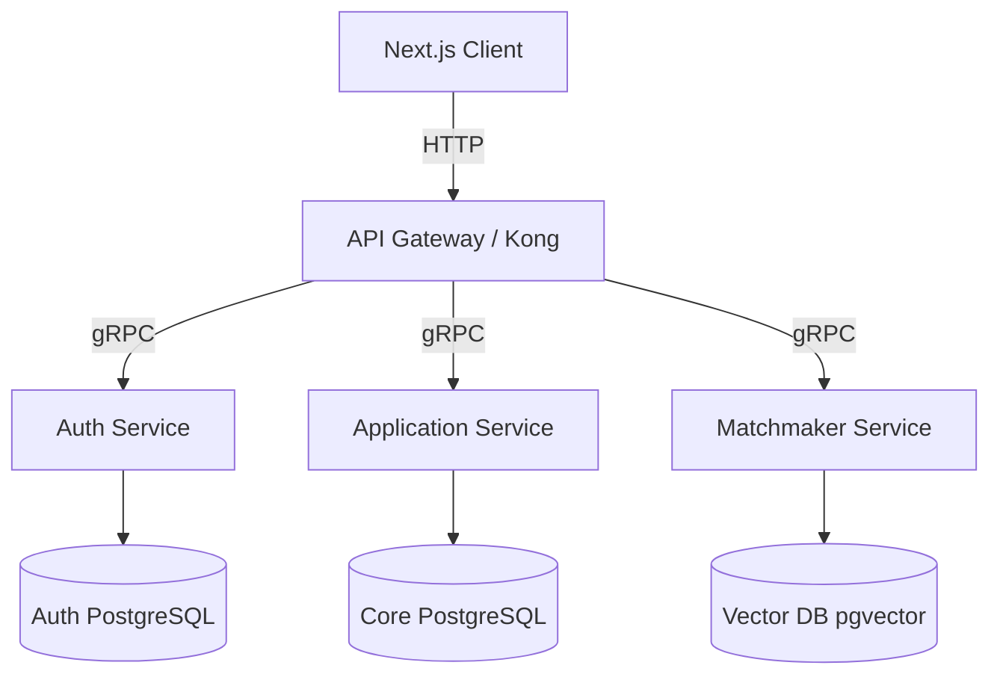

# Startup Incubator Platform: Architectural Migration Guide

This directory documents the structural microservice split and high-throughput inter-service configurations for the Startup Incubator Platform.

## 1. Go Microservices Architecture

Unlike a monolith, SIP is designed from day one to operate as independent microservices communicating via **gRPC**.

## 2. Dynamic Communication Configurations
- **Protocol Buffers:** All service APIs are defined in `.proto` files, compiled to native Go and TypeScript models for contract safety.
- **Message Broker:** RabbitMQ handles event broadcasting (e.g. "Startup Applied" event triggers notification, email, and matchmaking tasks).
