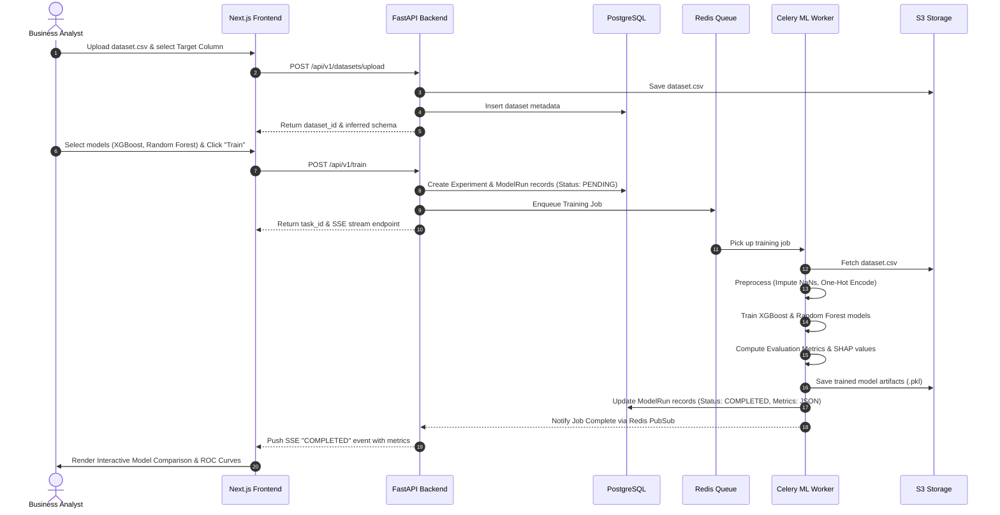
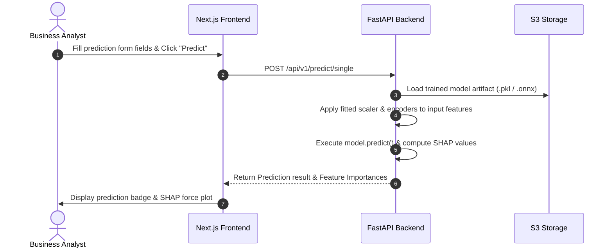

# ML Studio: Architectural Diagrams & Process Flowcharts

This directory contains Mermaid process sequence diagrams and data pipeline blueprints for ML Studio.

## 1. End-to-End Model Training Sequence

## 2. Real-Time Inference Sequence

