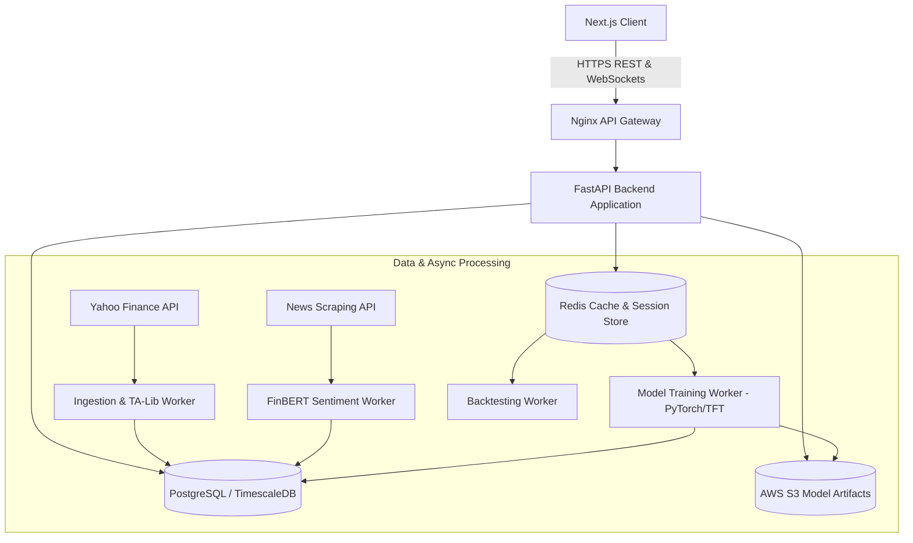

# AlphaForecast AI: Architecture & Pipeline Decoupling

This directory documents the technical architecture, data ingestion flow, model inference lifecycle, and cloud scalability for the Stock Market Forecasting System.

## 1. System Architecture Diagram

## 2. Low-Latency Caching & Streaming Strategy

1. **Intraday Price Caching:** Real-time stock prices are cached in Redis with a 15-second TTL to avoid API rate limits.
2. **Pre-computed Model Predictions:** Heavy deep learning predictions (TFT, LSTM) run on nightly batch schedules, saving results into `predictions` table for instant sub-50ms API retrieval.
3. **TimescaleDB Partitioning:** Time-series tables are partitioned into monthly hypertable chunks for zero-latency historical queries across multi-year charts.
