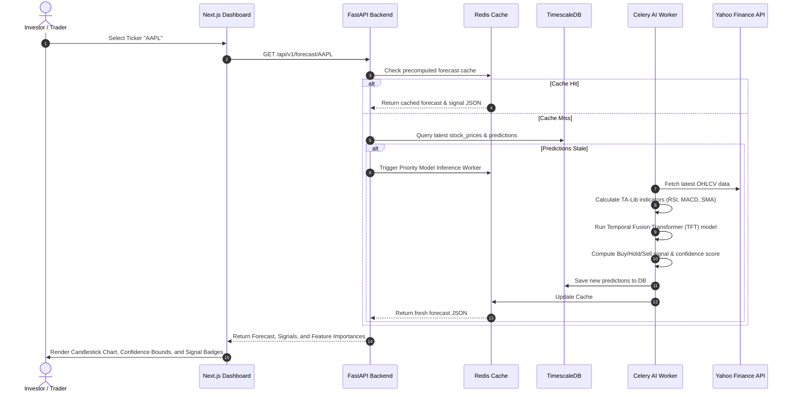
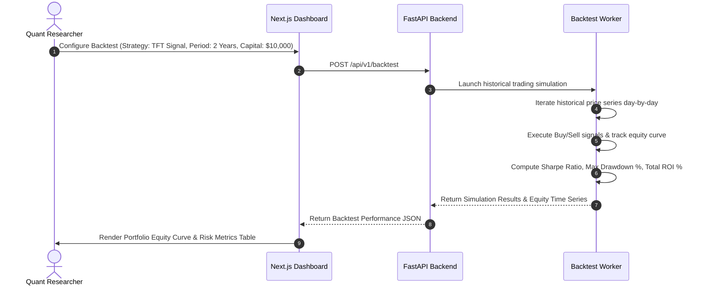

# AlphaForecast AI: Process Sequence & Workflow Diagrams

This directory contains Mermaid workflow sequence diagrams for data ingestion, feature calculation, deep learning inference, and backtesting.

## 1. Automated Forecast & Signal Pipeline

## 2. Quantitative Backtesting Sequence

