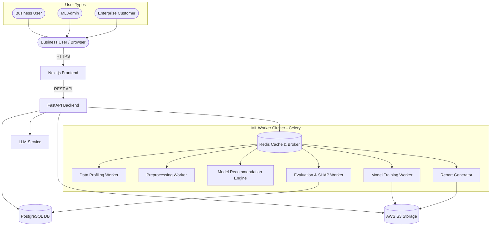

# Project Proposal

## InsightFlow AI — No-Code Predictive Analytics Platform

---

**Submitted By:** [Your Name]
**Department:** [Your Department]
**Institution:** [Your College Name]
**Academic Year:** 2025 – 2026
**Project Guide / Mentor:** [Mentor Name]
**Date:** July 2026

---

## Table of Contents

1. Executive Summary
2. Problem Statement
3. Proposed Solution
4. Supported Machine Learning Tasks
5. Supported Models
6. User Workflow
7. User Roles & Responsibilities
8. Platform Features
9. AI & Intelligence Features
10. Implementation Plan
11. Technology Stack
12. System Architecture
13. Research Potential
14. Facts & Industry Figures
15. Why This Is a Major Project
16. Future Scope
17. Conclusion

---

## 1. Executive Summary

Every organization today generates data. Banks track transactions. Hospitals record patient histories. Retailers log sales. Schools monitor student grades. Yet, for most of these organizations, this data sits unused — because turning raw data into predictions requires programming skills, machine learning expertise, and expensive infrastructure that most businesses simply do not have.

**InsightFlow AI** is a No-Code Predictive Analytics Platform that changes this entirely.

Instead of writing Python code or hiring a team of data scientists, business users simply upload their dataset, describe their business problem in plain language, and the platform automatically cleans the data, selects the best machine learning models, trains them, evaluates performance, generates visual analytics, and produces a downloadable report — all through a simple, intuitive web interface.

This is a complete, production-ready final-year project that brings together full-stack engineering, machine learning pipelines, cloud deployment, and applied AI into a single, powerful platform.

---

## 2. Problem Statement

### 2.1 Data Without Intelligence

Organizations across every industry are sitting on valuable data but lack the tools and expertise to extract meaningful predictions from it.

| Industry | Data They Collect | Prediction They Need |
| :--- | :--- | :--- |
| **Banking** | Transaction records, loan history, credit scores | Loan approval, fraud detection, customer churn |
| **Healthcare** | Patient records, lab reports, diagnostics | Disease risk, readmission prediction, resource planning |
| **Retail** | Sales logs, customer purchase history | Demand forecasting, product recommendations |
| **Insurance** | Policy data, claim history, demographics | Claim prediction, risk scoring |
| **Education** | Attendance, grades, assignments, behavior | Student performance, dropout risk prediction |
| **E-Commerce** | Browse history, cart data, reviews | Customer segmentation, sentiment analysis |

### 2.2 Why Organizations Cannot Use Machine Learning Today

Even when organizations have the data, they face four major barriers:

**Barrier 1 — It Requires Programming**
Machine learning requires writing code in Python — using libraries like Pandas, Scikit-Learn, TensorFlow, and PyTorch. Most business users — managers, analysts, doctors, teachers — are not programmers.

**Barrier 2 — It Is Expensive**
Hiring a professional data scientist costs between ₹8–25 lakhs per year. For small and medium organizations, this is simply unaffordable.

**Barrier 3 — It Is Slow**
Building a custom ML model for a business problem — from data cleaning to deployment — typically takes 4–12 weeks. Business decisions cannot wait that long.

**Barrier 4 — It Is Not Accessible**
Existing enterprise ML platforms like DataRobot or Google AutoML require cloud configuration, IT knowledge, and significant setup overhead, making them unsuitable for non-technical users.

### 2.3 The Gap

There is a clear and growing gap: organizations have data, but they lack the AI expertise and tools to make predictions from it. **InsightFlow AI fills this gap.**

---

## 3. Proposed Solution

InsightFlow AI is a web-based No-Code Machine Learning platform. Users interact with a guided, step-by-step interface — no programming required at any stage.

### Complete Platform Workflow

```
User uploads a CSV or Excel dataset
            │
            ▼
Platform automatically detects data types
(numeric, categorical, date, text columns)
            │
            ▼
User selects their Business Problem
(e.g., "Predict customer churn")
            │
            ▼
Platform recommends the best-suited ML models
            │
            ▼
Automatic Data Preprocessing
(Missing values → Encoding → Normalization)
            │
            ▼
Model Training (runs in the background)
            │
            ▼
Performance Evaluation
(Accuracy, F1, RMSE, ROC charts)
            │
            ▼
Predictions generated on new data
            │
            ▼
Interactive Visual Analytics (Plotly charts)
            │
            ▼
Downloadable PDF / CSV Report
```

Every step is guided, automated, and explained in plain English — no ML knowledge required.

---

## 4. Supported Machine Learning Tasks

InsightFlow AI supports seven machine learning task types, covering the most common real-world business problems.

| ML Task | What It Does | Business Example |
| :--- | :--- | :--- |
| **Classification** | Predicts which category a record belongs to | Will this customer churn? (Yes / No) |
| **Regression** | Predicts a numerical value | What will the house price be? |
| **Clustering** | Groups similar records together automatically | Segment customers into behavior groups |
| **Time Series Forecasting** | Predicts future values based on historical trends | Forecast next month's sales revenue |
| **Recommendation Systems** | Suggests items based on preferences or history | Recommend products to a user |
| **Anomaly Detection** | Identifies unusual or suspicious records | Flag fraudulent bank transactions |
| **Natural Language Processing** | Analyzes and understands text data | Analyze customer review sentiment |

---

## 5. Supported Models

The platform includes a curated library of production-grade machine learning models across all task types.

### 5.1 Classification Models

| Model | Description |
| :--- | :--- |
| **Logistic Regression** | A fast, reliable baseline model for binary outcomes (Yes/No, True/False) |
| **Decision Tree** | Builds a visual tree of decisions — easy to explain and interpret |
| **Random Forest** | Combines hundreds of Decision Trees for higher accuracy |
| **XGBoost** | Industry-standard gradient boosting — wins most Kaggle competitions |
| **SVM (Support Vector Machine)** | Excellent for smaller datasets with clear boundaries between classes |
| **Naive Bayes** | Fast probabilistic model — ideal for text classification |

### 5.2 Regression Models

| Model | Description |
| :--- | :--- |
| **Linear Regression** | Baseline model for predicting continuous numeric values |
| **Ridge Regression** | Linear regression with penalty to prevent overfitting |
| **Lasso Regression** | Automatically eliminates irrelevant features during training |
| **Random Forest Regressor** | Ensemble-based accurate numeric predictor |
| **XGBoost Regressor** | High-performance regression on tabular business data |

### 5.3 Clustering Models

| Model | Description |
| :--- | :--- |
| **KMeans** | Groups data into K user-defined clusters — fast and scalable |
| **DBSCAN** | Discovers clusters of arbitrary shapes — handles noise well |
| **Hierarchical Clustering** | Builds a tree of clusters — useful for exploring data structure |

### 5.4 Time Series Models

| Model | Description |
| :--- | :--- |
| **Prophet** | Developed by Meta — handles seasonal trends and holidays automatically |
| **ARIMA** | Classical statistical forecasting model — reliable for stable time series |
| **LSTM (Deep Learning)** | Neural network for complex multi-variable time series patterns |

### 5.5 Recommendation Models

| Model | Description |
| :--- | :--- |
| **Collaborative Filtering** | Recommends based on what similar users liked |
| **Content-Based Recommendation** | Recommends based on item attributes and user preferences |

### 5.6 NLP Models

| Model | Description |
| :--- | :--- |
| **TF-IDF + Classifier** | Fast keyword-based text classification |
| **BERT Transformer** | State-of-the-art language understanding — deep contextual analysis |
| **Sentiment Analysis** | Classifies text as Positive, Neutral, or Negative |

---

## 6. User Workflow

The platform guides every user through a simple, 8-step process — no technical knowledge required.

| Step | What Happens | User Effort |
| :--- | :--- | :--- |
| **1. Upload Dataset** | User drags and drops a CSV or Excel file | Minimal — just upload |
| **2. Choose Industry** | User selects: Banking / Healthcare / Retail / Other | One click |
| **3. Select Problem Type** | User describes the goal (e.g., "Predict loan approval") | One click |
| **4. Platform Analyzes Data** | Schema detection, data quality report, missing value summary | Automated |
| **5. Configure Parameters** | User adjusts basic settings (train/test split, target column) | Simple dropdowns |
| **6. Run Model** | Background training — progress bar shown on screen | One click |
| **7. View Results** | Accuracy scores, confusion matrix, SHAP charts, predictions | Interactive view |
| **8. Download Report** | Full PDF / CSV report with charts and insights | One click |

---

## 7. User Roles & Responsibilities

| Role | Who They Are | What They Can Do |
| :--- | :--- | :--- |
| **Business User** | Analyst, manager, domain expert | Upload data, run predictions, view and export results |
| **ML Administrator** | Data science lead or internal tech team | Configure models, manage compute resources, set quotas |
| **Platform Administrator** | IT or SaaS admin | Manage user accounts, monitor system health, configure settings |
| **Enterprise Customer** | Company-level account with multiple users | Access dedicated workspace, team projects, API integration |

---

## 8. Platform Features

### 8.1 Data Management
- **Dataset Upload:** Drag-and-drop CSV/Excel upload with file size validation and preview.
- **Automatic Data Profiling:** Instantly summarize each column — type, missing percentage, unique values, distribution.
- **Missing Value Handling:** Impute missing data using mean, median, mode, or smart interpolation — automatically.
- **Feature Encoding:** Convert categorical columns (e.g., "Male/Female") into machine-readable numbers — automatically.
- **Normalization / Scaling:** Scale numeric features to a standard range so models perform consistently.

### 8.2 Model Intelligence
- **Model Recommendation Engine:** Based on dataset size, column types, and selected task — the platform suggests the 3 most suitable models ranked by expected performance.
- **Model Training:** Background asynchronous training — users see a live progress bar while the model runs.
- **Model Comparison:** Train multiple models side-by-side and compare their performance metrics in a table.
- **Model Versioning:** Save and manage multiple model versions for the same dataset — track improvements over time.
- **Hyperparameter Tuning:** Automatically find the best model settings using Optuna (Bayesian search) without manual configuration.

### 8.3 Visualization & Analytics
- **Performance Charts:** ROC-AUC curve, Confusion Matrix, Loss curves, Residual plots — rendered as interactive Plotly charts.
- **Prediction Dashboard:** Run real-time predictions on new single records or batch data via CSV upload.
- **SHAP Feature Importance:** Visual explanation of which features (columns) drive predictions and by how much.
- **Interactive Charts:** Zoomable, filterable Plotly charts that respond to user interaction.

### 8.4 Project & Export
- **Project Management:** Organize datasets and experiments into named projects — track history.
- **Export Reports:** Download PDF executive reports or CSV prediction files in one click.
- **API Access:** Auto-generated REST API endpoints for each trained model — developers can integrate predictions into their own apps.

---

## 9. AI & Intelligence Features

These are smart features built into the platform that go beyond standard ML training.

| AI Feature | What It Does |
| :--- | :--- |
| **Automatic Model Recommendation** | Analyzes dataset characteristics to suggest the best model — no expertise needed |
| **Automatic Feature Selection** | Identifies the most informative columns and removes irrelevant ones automatically |
| **Explainable AI (XAI)** | Explains every prediction in plain English — not just a number |
| **SHAP Feature Importance** | Visual charts showing which input variable influenced each prediction the most |
| **Hyperparameter Auto-Tuning** | Runs hundreds of model configurations automatically to find the best one |
| **Business Insight Generator** | Generates a short plain-English paragraph summarizing key findings from the model results |
| **LLM Dataset Assistant** | Users can ask questions about their data in plain English (e.g., "What is the average salary by department?") |
| **Natural Language Query** | Type queries like "Show me customers who are likely to churn" — platform interprets and responds |
| **Dataset Summary Generator** | Automatically writes a one-page summary of the dataset — distributions, anomalies, key statistics |

> **Feasibility Note:** The LLM features use OpenAI GPT API or a locally hosted lightweight model (Mistral 7B). They are optional add-ons and do not affect core ML functionality.

---

## 10. Implementation Plan

The platform will be built across four phases over five months.

| Phase | Timeline | Key Deliverables |
| :--- | :--- | :--- |
| **Phase 1 — Foundation** | Month 1 | Project setup, PostgreSQL schema, FastAPI backend, JWT authentication, Next.js frontend shell, file upload system |
| **Phase 2 — ML Engine Core** | Months 2–3 | Data profiling engine, preprocessing pipeline, Scikit-Learn model training, evaluation metrics, Celery async worker queue |
| **Phase 3 — Visualization & AI Features** | Month 4 | Plotly dashboard, SHAP integration, model comparison, report generator (PDF/CSV), LLM dataset assistant |
| **Phase 4 — Deployment & Polish** | Month 5 | Docker containerization, AWS deployment, API gateway, end-to-end testing, performance optimization |

---

## 11. Technology Stack

| Layer | Technology | Why This Was Chosen |
| :--- | :--- | :--- |
| **Frontend** | Next.js (React) | Fast, component-based, industry-standard for modern web apps |
| **Backend API** | FastAPI (Python) | Asynchronous, high-performance — perfect for ML workloads |
| **ML Core** | Scikit-Learn | Industry-standard classical ML — wide algorithm coverage |
| **Deep Learning** | TensorFlow / PyTorch | For LSTM time series and BERT NLP models |
| **Database** | PostgreSQL | Robust relational DB — excellent for structured metadata |
| **Task Queue** | Celery + Redis | Handles background model training without blocking the web server |
| **Visualization** | Plotly | Interactive, web-ready charts — works perfectly with React |
| **Storage** | AWS S3 | Scalable cloud storage for datasets and model artifacts |
| **Authentication** | JWT + RBAC | Secure, stateless token authentication with role separation |
| **Deployment** | Docker + AWS ECS | Containerized, portable, production-ready cloud deployment |
| **AI Features** | OpenAI API / Optuna | Powers LLM assistant and automatic hyperparameter tuning |

---

## 12. System Architecture

### Architecture Overview

```
User (Browser)
      │
      ▼
Next.js Frontend (React UI)
      │  REST API calls
      ▼
FastAPI Backend Application
      │
      ├─── PostgreSQL Database (metadata, users, experiments)
      │
      ├─── Redis + Celery (async training job queue)
      │         │
      │         ▼
      │    ML Worker Engine
      │    ├── Data Profiling & Preprocessing
      │    ├── Model Recommendation Engine
      │    ├── Training Pipeline (Scikit-Learn / PyTorch)
      │    ├── Evaluation & SHAP Engine
      │    └── Report Generator (PDF / CSV)
      │
      ├─── AWS S3 (dataset files & model artifacts)
      │
      └─── LLM Service (OpenAI API or local Mistral)
                 └── Dataset Assistant / Insight Generator
```

### Architecture Diagram



Each component is independently deployable and scalable. The ML Worker Cluster can be scaled horizontally by adding more worker nodes during peak usage.

---

## 13. Research Potential

InsightFlow AI is not just a student project — it opens genuine research directions across multiple active areas of AI and human-computer interaction.

| Research Area | Description |
| :--- | :--- |
| **AutoML & Model Recommendation** | Study how to best recommend ML algorithms based on dataset meta-features (size, type, cardinality) |
| **Explainable AI (XAI)** | Research how to present SHAP and LIME explanations in ways non-technical users can actually understand |
| **AI Democratization** | Case study on how No-Code AI platforms change who can use machine learning in organizations |
| **Human-AI Interaction** | How do business users make decisions when AI provides probability scores and confidence intervals? |
| **Dataset Understanding** | Develop algorithms that automatically summarize, describe, and recommend actions for unknown datasets |
| **No-Code Platform Design** | UI/UX research on the best interface patterns for guiding non-programmers through ML workflows |
| **Benchmark Study** | Evaluate how AutoML pipelines compare to hand-tuned expert models on business datasets |

Each of these topics represents a publishable research contribution — either as a conference paper or journal article.

---

## 14. Facts & Industry Figures

> The following are publicly reported statistics from recognized market research and industry surveys.

| Statistic | Source |
| :--- | :--- |
| The global AI market is expected to grow to **$1.81 trillion by 2030** | Grand View Research, 2024 |
| The **AutoML market** was valued at $1.14 billion in 2023 and is growing at 44.6% CAGR | MarketsandMarkets, 2023 |
| The global **Business Intelligence market** is projected to reach **$33.3 billion by 2025** | Fortune Business Insights |
| Only **26% of organizations** have successfully deployed ML models at scale | Gartner, 2023 |
| **87% of data science projects never reach production** due to complexity and cost | VentureBeat Research |
| The **low-code / no-code AI market** is growing at 28.1% CAGR — driven by demand from SMBs | IDC Research, 2023 |
| Demand for **AI automation** tools in business grew by **65%** between 2021 and 2024 | McKinsey Digital, 2024 |

These numbers confirm that the business need for accessible, no-code AI platforms is real, massive, and growing rapidly.

---

## 15. Why This Is a Major Project

This is not a simple "train a model and show accuracy" project. Here is a direct comparison:

| Dimension | Basic ML Notebook | InsightFlow AI Platform |
| :--- | :--- | :--- |
| User Interface | None — Python only | Full Next.js web application |
| ML Tasks Covered | 1 specific task | 7 complete task categories |
| Models Available | 1 or 2 | 20+ production-ready models |
| Data Preprocessing | Manual coding | Fully automated pipeline |
| Model Recommendation | Not available | AI-powered recommendation engine |
| Model Comparison | Manual | Automated side-by-side comparison |
| Explainability | Not available | SHAP visualizations + plain text |
| Async Training | Not available | Celery worker queue |
| Visualization | Matplotlib static plots | Interactive Plotly dashboards |
| Report Export | Not available | PDF + CSV export |
| API Access | Not available | Auto-generated REST API per model |
| LLM Assistant | Not available | NLP-powered dataset Q&A |
| Cloud Deployment | Not available | Docker + AWS ECS production |
| User Roles | Not applicable | 4 distinct roles with RBAC |

This project demonstrates expertise in **full-stack development, machine learning engineering, cloud architecture, applied AI, and product design** — all integrated into a single, working product.

---

## 16. Future Scope

Once the core platform is complete, the following enhancements can be built:

- **LLM-Powered Generative BI Reports** — Automatically generate a full business intelligence narrative report using large language models, explaining patterns, trends, and risks in plain English.
- **Voice-Based Analytics Interface** — Allow users to speak queries ("How many customers are at high churn risk?") and receive spoken + visual responses.
- **Real-Time Streaming Analytics** — Support live data ingestion via Kafka or WebSockets for real-time prediction on streaming events (e.g., live transaction fraud detection).
- **Auto Feature Engineering** — Automatically create new predictive features from existing data (e.g., deriving "account age" from "join date") to improve model accuracy.
- **MLOps Integration** — Connect to CI/CD pipelines so models retrain automatically when new data arrives — keeping predictions fresh.
- **Enterprise Dashboard** — Multi-team collaboration workspace with shared datasets, models, and access controls.
- **Cloud AutoML** — Leverage Google Vertex AI or AWS SageMaker Autopilot as training backends for large-scale datasets.
- **Multi-Modal AI** — Support image and audio datasets in addition to tabular and text data.

---

## 17. Conclusion

Organizations across every industry — banking, healthcare, retail, education, and insurance — collect enormous amounts of structured data every day. Yet, the majority of this data goes unused for predictions, because machine learning today requires expensive expertise, months of development, and deep programming knowledge.

**InsightFlow AI solves this directly.** By wrapping the entire machine learning lifecycle — data upload, preprocessing, model selection, training, evaluation, visualization, and export — inside a clean, guided web interface, this platform puts the power of AI in the hands of business users who have never written a line of code.

The project is technically ambitious — spanning a full-stack web application, asynchronous ML worker pipelines, seven machine learning paradigms with 20+ models, explainable AI, an LLM-powered assistant, interactive visualizations, and cloud deployment. At the same time, it addresses a clear, real-world problem that affects millions of organizations globally.

This is the kind of project that makes a strong final-year thesis, produces publishable research, and builds a portfolio that stands out to any employer in the software engineering or data science field.

---

*Document Prepared By: [Your Name]*
*Contact: [Your Email]*
*GitHub Repository: [Your Repository URL]*
