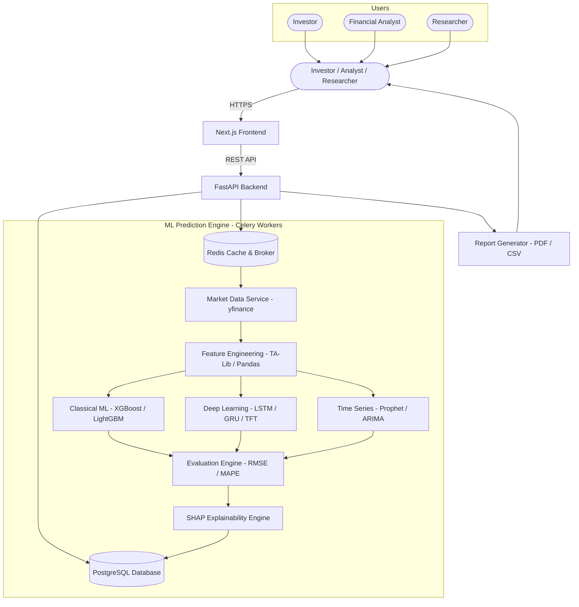

# Project Proposal

## MarketMind AI — AI-Powered Financial Intelligence & Forecasting Platform

---

**Submitted By:** [Your Name]
**Department:** [Your Department]
**Institution:** [Your College Name]
**Academic Year:** 2025 – 2026
**Project Guide / Mentor:** [Mentor Name]
**Date:** July 2026

---

## Table of Contents

1. Executive Summary
2. Problem Statement
3. Proposed Solution
4. Supported AI & Machine Learning Models
5. Input Features & Data Engineering
6. Platform Outputs
7. User Workflow
8. User Roles & Responsibilities
9. Platform Features
10. AI & Intelligence Features
11. Implementation Plan
12. Technology Stack
13. System Architecture
14. Research Potential
15. Facts & Industry Figures
16. Limitations & Disclaimer
17. Why This Is a Major Project
18. Future Scope
19. Conclusion

---

## 1. Executive Summary

Financial markets generate enormous amounts of data every single day — stock prices, trading volumes, technical signals, market news, and macroeconomic indicators. Yet, for most individual investors and small financial analysts, making sense of all this data is extremely difficult. Professional tools are expensive. Manual chart analysis takes hours. And no reliable, accessible AI-powered platform exists for everyday users.

**MarketMind AI** is an AI-powered Financial Intelligence and Forecasting Platform that addresses this gap directly.

Users select a stock, choose a forecast horizon, and the platform automatically downloads historical data, engineers technical features, runs multiple AI models, generates forecasts with confidence scores, and presents everything in an interactive, intuitive dashboard.

This platform is designed as a **decision-support and educational research tool** — not as a financial advisor. It demonstrates how modern machine learning and deep learning can be applied to real-world financial time-series data.

> **Important:** This platform provides AI-assisted educational insights only. It does not constitute financial advice. All forecasts are for research and academic purposes.

---

## 2. Problem Statement

### 2.1 Who Struggles With Financial Markets

Stock markets are one of the most data-rich environments in the world. Yet, three distinct groups consistently face barriers when trying to use this data meaningfully:

| User Group | Core Challenge |
| :--- | :--- |
| **Individual Investors** | Difficulty reading charts, limited understanding of indicators, information overload |
| **Financial Analysts** | Manually processing large datasets, time-consuming forecasting, no automation |
| **Businesses & Institutions** | Need rapid market insights for investment decisions — current tools are expensive |

### 2.2 Why Stock Markets Are So Difficult to Predict

Markets are not simple mathematical systems. They are influenced by dozens of overlapping factors simultaneously:

- **Historical Price Patterns:** Past price behavior only partially predicts future movement.
- **Trading Volume:** Sudden volume changes often precede major price moves.
- **Market Sentiment:** Investor psychology and media narratives drive irrational swings.
- **Macroeconomic Factors:** Interest rates, inflation, and GDP affect entire sectors.
- **Global Events:** Geopolitical conflicts, pandemics, or regulatory changes can instantly reverse trends.
- **Investor Psychology:** Fear and greed cause markets to deviate from rational pricing for extended periods.

This combination makes stock price prediction one of the hardest problems in data science — and one of the most researched.

### 2.3 Why Traditional Methods Are Insufficient

| Traditional Method | Limitation |
| :--- | :--- |
| Manual Chart Analysis | Time-consuming, subjective, depends on human experience |
| Simple Moving Averages | Lagging indicators — signal changes after they already happened |
| Fundamental Analysis | Requires accounting knowledge and access to financial statements |
| Bloomberg / Reuters Terminal | Costs $20,000+ per year — out of reach for individuals |
| Excel-Based Models | Cannot handle the volume, speed, or complexity of modern market data |

There is a clear need for an **accessible, intelligent, multi-model forecasting platform** that automates this complexity for everyday users — and MarketMind AI delivers exactly that.

---

## 3. Proposed Solution

MarketMind AI is a web-based, AI-powered platform that automates the full pipeline from raw stock data to structured, visual forecasts and analytical insights.

### Complete Platform Workflow

```
User selects a stock (e.g., AAPL, RELIANCE.NS)
              │
              ▼
Selects Forecast Time Horizon (7-day / 30-day / 90-day)
              │
              ▼
Platform downloads Historical OHLCV Data via Yahoo Finance API
              │
              ▼
Automated Feature Engineering
(Moving Averages, RSI, MACD, Bollinger Bands, Volatility)
              │
              ▼
Multiple AI Models run in parallel
(LSTM, GRU, Transformer, XGBoost, Prophet, ARIMA)
              │
              ▼
Forecasts generated with Confidence Scores
              │
              ▼
Trend Classification: Bullish / Bearish / Sideways
              │
              ▼
Educational Signal: Buy / Hold / Sell (for research only)
              │
              ▼
Interactive Dashboard with Plotly Charts
              │
              ▼
Model Comparison Table & SHAP Feature Importance
              │
              ▼
Export: PDF Report / CSV Data
```

Every step is automated. Users only need to select a stock and press Run.

---

## 4. Supported AI & Machine Learning Models

MarketMind AI uses a diverse ensemble of models — from classical statistics to state-of-the-art deep learning — to capture different patterns in financial time series.

### 4.1 Machine Learning Models

| Model | Description | Best For |
| :--- | :--- | :--- |
| **Linear Regression** | Baseline model — fast and interpretable. Fits a straight trend line. | Simple trend extrapolation |
| **Random Forest** | Combines hundreds of decision trees. Handles non-linear patterns well. | Mid-term feature-rich forecasting |
| **XGBoost** | Gradient-boosted trees — industry standard for tabular financial data. | High-accuracy tabular prediction |
| **LightGBM** | Faster version of XGBoost with lower memory usage on large datasets. | High-speed indicator-based forecasting |

### 4.2 Deep Learning Models

| Model | Description | Best For |
| :--- | :--- | :--- |
| **LSTM** | Long Short-Term Memory — remembers long-range patterns in sequences. | Multi-week price trend modeling |
| **GRU** | Gated Recurrent Unit — faster than LSTM with comparable accuracy. | Shorter-horizon sequence prediction |
| **Transformer** | Attention-based model that captures complex, non-local time correlations. | Volatile, high-frequency patterns |
| **Temporal Fusion Transformer (TFT)** | State-of-the-art interpretable forecasting with uncertainty quantification. | Multi-horizon + explainable forecasting |

### 4.3 Classical Time Series Models

| Model | Description | Best For |
| :--- | :--- | :--- |
| **ARIMA** | Statistical model using autocorrelation — reliable on stable price series. | Linear trend baseline comparison |
| **Prophet** | Meta's forecasting tool — handles seasonality, trends, and holidays. | Annual/seasonal market pattern forecasting |

> **Why Multiple Models?** No single model performs best on all stocks in all market conditions. By running multiple models and comparing their outputs, users get a much more robust and reliable view of forecasted trends.

---

## 5. Input Features & Data Engineering

The quality of a forecast is determined by the quality of its input features. MarketMind AI automatically engineers a rich set of financial features from raw price data.

| Feature | Description | Why It Matters |
| :--- | :--- | :--- |
| **Open, High, Low, Close (OHLC)** | Daily price range — the foundation of all technical analysis | Raw price signal |
| **Trading Volume** | Number of shares traded per day | High volume often confirms price moves |
| **SMA (Simple Moving Average)** | Average price over N days — smooths out noise | Identifies overall trend direction |
| **EMA (Exponential Moving Average)** | Weighted average giving more importance to recent prices | Faster trend signal than SMA |
| **RSI (Relative Strength Index)** | Oscillator (0–100) measuring speed and momentum of price change | Detects overbought / oversold conditions |
| **MACD** | Difference between 12-day and 26-day EMA — momentum indicator | Signals trend reversals and momentum |
| **Bollinger Bands** | Price bands drawn ±2 standard deviations from moving average | Measures volatility and price breakouts |
| **Volatility (ATR)** | Average True Range — measures daily price swings | Quantifies market risk |
| **Market Index (Nifty 50 / S&P 500)** | Broader market benchmark | Context for stock's relative performance |
| **Sector Performance** | Performance of the stock's industry sector | Industry-level momentum signal |
| **News Sentiment Score** *(Optional)* | NLP-derived sentiment from financial headlines | Captures market psychology |

All features are computed automatically using **TA-Lib**, **Pandas**, and **NumPy** — no manual calculation required.

---

## 6. Platform Outputs

Every forecast run produces a rich set of structured outputs:

| Output | Description |
| :--- | :--- |
| **Predicted Closing Price** | Forecasted price for each day in the selected horizon |
| **Trend Prediction** | Classifies direction: Bullish (upward), Bearish (downward), or Sideways |
| **Confidence Score** | A 0–100% score indicating the model's certainty in its forecast |
| **Educational Signal** | Buy / Hold / Sell label — for research and learning purposes only |
| **Forecast Graph** | Interactive Plotly chart showing historical data + predicted trajectory |
| **Historical Comparison** | Overlay of previous model predictions vs actual price to evaluate accuracy |
| **Feature Importance** | SHAP chart showing which indicators drove the current forecast |
| **Risk Analysis** | Volatility metrics, Value-at-Risk (VaR), and expected price range |
| **Model Comparison Table** | Side-by-side RMSE, MAPE, and Directional Accuracy across all models |

---

## 7. User Workflow

| Step | What Happens | User Action |
| :--- | :--- | :--- |
| **1. Search Stock** | User types a ticker (e.g., AAPL, TCS.NS) — platform validates and loads stock info | Type ticker |
| **2. Select Time Horizon** | Choose forecast period: 7-day, 30-day, or 90-day | One dropdown |
| **3. Run Forecast** | Platform downloads data, engineers features, trains/inferences all models | Click "Run" |
| **4. View Dashboard** | Interactive charts, trend label, confidence score, and feature importance appear | Explore freely |
| **5. Compare Models** | Side-by-side comparison of all model predictions and accuracy metrics | Click "Compare" |
| **6. Download Report** | Export full PDF analysis report or raw CSV forecast data | One click |

---

## 8. User Roles & Responsibilities

| Role | Who They Are | What They Can Do |
| :--- | :--- | :--- |
| **Investor** | Retail investor, student, individual user | Search stocks, run forecasts, view dashboards, download reports |
| **Financial Analyst** | Professional or academic researcher | Access advanced model outputs, compare models, export data for external analysis |
| **Researcher** | Academic or ML researcher | Access raw model performance metrics, run custom backtests, view SHAP outputs |
| **Administrator** | Platform operator / IT admin | Manage users, monitor API usage, configure data refresh schedules |

---

## 9. Platform Features

### 9.1 Data & Discovery
- **Stock Search:** Search any stock by ticker or company name — supports NSE, BSE, NYSE, NASDAQ indices.
- **Portfolio Watchlist:** Save multiple stocks for quick access and side-by-side monitoring.
- **Historical Charts:** Interactive Plotly candlestick charts showing up to 10 years of price history.

### 9.2 Analytics & Forecasting
- **Technical Indicators Overlay:** Toggle SMA, EMA, RSI, MACD, and Bollinger Bands on historical charts.
- **Forecast Dashboard:** Visual display of predicted price trajectory with confidence intervals.
- **Model Comparison:** Run all models simultaneously and compare RMSE, MAPE, and Directional Accuracy.
- **Prediction History:** Archive of all previous forecasts — track how past predictions performed against actuals.
- **Performance Metrics:** Quantitative evaluation: RMSE, MAE, MAPE, R² Score, and Directional Accuracy.

### 9.3 Risk & Intelligence
- **Risk Analysis Dashboard:** Displays volatility, historical drawdown, Value-at-Risk (VaR 95%), and Sharpe Ratio.
- **Feature Importance (SHAP):** Visual explanation of which input features drove each model's forecast.

### 9.4 Export
- **Export Reports:** Download a full PDF analytical report or raw CSV prediction data with one click.

---

## 10. AI & Intelligence Features

| AI Feature | What It Does |
| :--- | :--- |
| **Multi-Model Comparison** | Runs LSTM, GRU, XGBoost, Prophet, and ARIMA simultaneously — shows which performs best |
| **Confidence Score** | Quantifies forecast certainty using prediction intervals from ensemble variance |
| **Feature Importance (SHAP)** | Visual chart showing which financial indicators drove each prediction |
| **Explainable AI (XAI)** | Plain-English sentence explaining why the model forecasts Bullish or Bearish |
| **Trend Detection** | Classifies price trajectory using combination of ML output and momentum indicators |
| **Volatility Prediction** | Estimates expected price range (upper/lower bounds) around the forecast |
| **Model Recommendation** | Suggests the best-performing model for the selected stock based on historical accuracy |
| **Risk Scoring** | Composite risk score combining volatility, trend strength, and market context |
| **Natural Language Summary** | Generates a 2–3 sentence plain-English market summary for each forecast run |
| **LLM Integration (Future)** | Natural language Q&A about any stock — "What is driving Tesla's trend this month?" |

---

## 11. Implementation Plan

The platform will be built across four phases over five months.

| Phase | Timeline | Key Deliverables |
| :--- | :--- | :--- |
| **Phase 1 — Foundation** | Month 1 | FastAPI backend, PostgreSQL schema, JWT auth, Next.js UI, Yahoo Finance data pipeline |
| **Phase 2 — Feature Engineering & ML Core** | Months 2–3 | TA-Lib indicator computation, Scikit-Learn / XGBoost models, ARIMA, Prophet integration, Celery async training |
| **Phase 3 — Deep Learning & Dashboard** | Month 4 | LSTM / GRU / Transformer models in PyTorch, Plotly interactive charts, SHAP integration, model comparison |
| **Phase 4 — Deployment & Polish** | Month 5 | Docker containerization, AWS ECS deployment, PDF report generator, end-to-end testing, performance optimization |

---

## 12. Technology Stack

| Layer | Technology | Why This Was Chosen |
| :--- | :--- | :--- |
| **Frontend** | Next.js (React) | Fast, modern, component-based — industry standard for web applications |
| **Backend API** | FastAPI (Python) | Async, high-performance — ideal for data-heavy ML workloads |
| **ML & Classical Models** | Scikit-Learn | Industry-standard library for regression, tree-based, and ensemble models |
| **Deep Learning** | PyTorch + TensorFlow | PyTorch for LSTM/GRU/Transformer; TensorFlow for TFT model |
| **Financial Indicators** | TA-Lib + Pandas + NumPy | Standard tools for computing RSI, MACD, Bollinger Bands, and moving averages |
| **Time Series** | Prophet (Meta) | Handles seasonality, trends, and holidays in stock data automatically |
| **Data Source** | yfinance (Yahoo Finance API) | Free, reliable, covers global exchanges — OHLCV + market data |
| **Visualization** | Plotly | Interactive financial charts — candlesticks, forecasts, SHAP plots |
| **Database** | PostgreSQL | Reliable relational storage for users, forecasts, watchlists, model results |
| **Task Queue** | Celery + Redis | Background model training without blocking the web server |
| **Authentication** | JWT + RBAC | Secure stateless tokens with role-based access |
| **Deployment** | Docker + AWS ECS | Containerized, scalable, production-ready cloud hosting |

---

## 13. System Architecture

### Architecture Overview

```
User Browser
     │
     ▼
Next.js Frontend (React UI + Plotly Charts)
     │  REST API
     ▼
FastAPI Backend Application
     │
     ├── PostgreSQL Database (users, forecasts, watchlists)
     │
     ├── Redis + Celery (async model training & inference)
     │         │
     │         ▼
     │    ML Prediction Engine
     │    ├── Market Data Service (yfinance)
     │    ├── Feature Engineering (TA-Lib / Pandas)
     │    ├── Classical ML (XGBoost / LightGBM / ARIMA)
     │    ├── Deep Learning (LSTM / GRU / Transformer / TFT)
     │    ├── Time Series (Prophet)
     │    ├── Evaluation Engine (RMSE / MAPE / Directional Acc.)
     │    └── SHAP Explainability Engine
     │
     └── Report Generator (PDF / CSV Export)
```

### Architecture Diagram



---

## 14. Research Potential

MarketMind AI sits at the intersection of machine learning, finance, and explainable AI — all active research areas with substantial publication opportunities.

| Research Direction | Description |
| :--- | :--- |
| **Time Series Forecasting in Finance** | Comparing classical (ARIMA) vs. deep learning (LSTM, TFT) on equity market data |
| **Deep Learning for Finance** | Evaluating Transformer and TFT architectures on non-stationary financial time series |
| **Explainable AI in Investment** | How SHAP explanations of financial model predictions can build user trust |
| **Hybrid ML Models** | Combining LSTM feature extraction with XGBoost output layer for ensemble forecasts |
| **Financial Decision Support Systems** | Studying how AI-assisted signals affect investor decision quality |
| **Model Comparison Studies** | Systematic benchmark of 10+ models across multiple stocks, market caps, and sectors |
| **Forecast Uncertainty Quantification** | Using conformal prediction and Bayesian methods to produce calibrated confidence intervals |

Each of these topics can be developed into a conference paper (IEEE, ACM, or SSRN) or journal submission.

---

## 15. Facts & Industry Figures

> The following statistics are from publicly reported industry research and recognized market studies.

| Statistic | Source |
| :--- | :--- |
| Global FinTech market expected to reach **$644 billion by 2029** | MarketsandMarkets, 2024 |
| AI in financial services market growing at **16.5% CAGR** through 2030 | Grand View Research, 2024 |
| Over **100 million retail investors** in India as of 2024 — tripled since 2020 | NSE India, 2024 |
| Algorithmic trading now accounts for **60–73% of U.S. equity market volume** | TABB Group / SEC Research |
| Global **Financial Analytics market** projected at $11.4 billion by 2026 | Allied Market Research |
| **65% of hedge funds** are now actively using ML for investment decisions | PwC Asset Management Report |
| Retail investors spend an average of **4–6 hours per week** on manual market research | Schwab Investor Survey, 2023 |

These numbers confirm that AI-powered financial analytics tools represent a massive, growing market — and that the gap between institutional and retail investor tools is real and widening.

---

## 16. Limitations & Disclaimer

This section is intentionally included to demonstrate technical honesty and awareness of real-world constraints — qualities that distinguish strong academic projects.

**What This Platform Does NOT Do:**
- It does not guarantee accurate future price predictions.
- It does not constitute financial advice of any kind.
- It is not suitable for making real investment decisions without independent professional guidance.

**Why Markets Are Fundamentally Hard to Predict:**
- Markets are influenced by unpredictable geopolitical events, regulatory changes, and human emotion.
- Even the best AI models cannot account for "black swan" events like pandemics or financial crises.
- All ML models are trained on historical data — past patterns do not always repeat.

**Technical Limitations:**
- Data sourced from Yahoo Finance may have occasional gaps or delays.
- Deep learning models require sufficient historical data — very new stocks may produce unreliable forecasts.
- Forecast accuracy degrades significantly beyond 30-day horizons for volatile stocks.

> **Platform Disclaimer:** All forecasts generated by MarketMind AI are for academic, educational, and research purposes only. The platform is a decision-support tool. Users should consult qualified financial advisors before making any investment decisions.

---

## 17. Why This Is a Major Project

This is frequently asked: *"Is this just another stock prediction website?"* The honest answer is no.

| Dimension | Basic Stock Predictor | MarketMind AI Platform |
| :--- | :--- | :--- |
| Models Used | 1 LSTM or 1 ARIMA | 10+ models: LSTM, GRU, TFT, XGBoost, LightGBM, Prophet, ARIMA, Transformer |
| Data Pipeline | Manual CSV download | Automated live Yahoo Finance API integration |
| Feature Engineering | None | 15+ technical indicators via TA-Lib |
| Explainability | None | SHAP feature importance + plain-English summary |
| Visualization | Static Matplotlib plots | Interactive Plotly financial dashboards |
| Model Comparison | Not available | Side-by-side RMSE / MAPE / Directional Accuracy |
| Risk Analysis | Not available | VaR, volatility, Sharpe Ratio, drawdown |
| Forecast Confidence | Not available | Calibrated confidence scores + uncertainty bounds |
| Export | Not available | PDF executive report + CSV data export |
| Multi-User System | Not available | 4 roles with JWT-based authentication |
| Cloud Deployment | Not available | Docker + AWS ECS production deployment |
| Architecture | Notebook or local script | Full-stack web application with async ML workers |

This project demonstrates expertise in **deep learning, financial data engineering, full-stack development, cloud architecture, and explainable AI** — all in a single, working product solving a real-world problem.

---

## 18. Future Scope

| Enhancement | Description |
| :--- | :--- |
| **News Sentiment Analysis** | Integrate live financial news via NLP (FinBERT) to add sentiment as a real-time prediction feature |
| **Reinforcement Learning Trading Agent** | Train an RL agent (PPO algorithm) to simulate buy/sell decision-making on historical data |
| **Portfolio Optimization** | Use Modern Portfolio Theory (MPT) and AI to suggest diversified portfolio allocations |
| **Cryptocurrency Forecasting** | Extend support to BTC, ETH, and other crypto assets — already available via yfinance |
| **Mutual Fund & ETF Analysis** | Support NAV-based forecasting and sector rotation analysis |
| **Real-Time Streaming** | Live intraday data ingestion via WebSockets for minute-by-minute prediction updates |
| **AI Financial Assistant (LLM)** | Chat interface: "Why is Infosys trending down this week?" — answered by LLM + data |
| **Mobile App** | React Native companion app for portfolio watchlist and forecast notifications |

---

## 19. Conclusion

Financial markets are one of the most complex, data-rich environments on earth. Yet, most individual investors and small analytical teams lack the tools, computing resources, and AI expertise to extract structured intelligence from this data.

**MarketMind AI bridges this gap.** By combining multiple deep learning and machine learning models, automated financial feature engineering, explainable AI outputs, interactive visualization, and a clean web interface — this platform puts sophisticated financial forecasting capability within reach of any user, regardless of their technical background.

This project is technically comprehensive — spanning a full-stack web application, asynchronous multi-model ML pipelines, deep learning (LSTM, GRU, Temporal Fusion Transformer), classical time-series models (Prophet, ARIMA), TA-Lib financial feature engineering, SHAP explainability, cloud deployment, and a multi-role user system. It tackles one of the most researched and challenging problems in data science — time-series forecasting on non-stationary financial data.

At the same time, it does so responsibly — by being fully transparent about its limitations and positioning itself clearly as a research and decision-support tool, not a financial advisor.

This is the kind of project that makes a compelling final-year thesis, generates publishable research, and stands out strongly in any data science or ML engineering portfolio.

---

*Document Prepared By: [Your Name]*
*Contact: [Your Email]*
*GitHub Repository: [Your Repository URL]*
